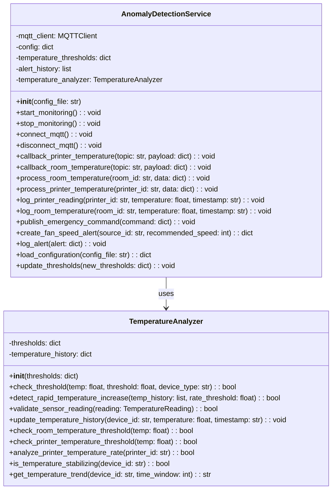

# Anomaly Detection Service


- [ ] trouble printer
- [ ] trouble room
- [ ] tester

- [ ] table of contents
- [ ] architecture class diagram
- [ ] division of concerns of classes
- [ ] folder structure explanation and division of concerns
- [ ] local run
- [ ] local test
- [ ] docker run

## Table of Contents

## Architecture Position

The Anomaly Detection service operates as an MQTT-based microservice that:

- Subscribes to temperature data from room sensors and printers
- Analyzes temperature patterns for anomalies
- Publishes emergency alerts to the Fan Controller when critical conditions are detected

```text
┌─────────────────┐    MQTT Topics      ┌─────────────────┐
│  Room Sensor    │ ──────────────────► │   Anomaly       │
│                 │ device/room/temp    │   Detection     │
└─────────────────┘                     │                 │
                                        │                 │
┌─────────────────┐    MQTT Topics      │                 │
│  3D Printers    │ ──────────────────► │                 │
│                 │ device/printer/     │                 │
└─────────────────┘ {id}/temperature    └─────────────────┘
                                                │ MQTT Topics
                                                │ Emergency Alerts
                                                │ device/fan/
                                                │ controller/emergency
                                                ▼
                                        ┌─────────────────┐
                                        │  Fan Controller │
                                        │                 │
                                        └─────────────────┘
```

## Communication Protocols

### MQTT Subscriptions

#### Room Temperature Data Input

- **Topic**: `device/room/temperature`
- **Type**: 2.1.2) TemperatureReading
- **Purpose**: Monitor room temperature

#### Printer Temperature Data Input

- **Topic**: `device/printer/{printerId}/temperature`
- **Type**: 2.1.2) TemperatureReading
- **Purpose**: Monitor individual printer temperatures

### MQTT Publications

#### Emergency Alerts

- **Topic**: `device/fan/controller/emergency`
- **Type**: 2.4.3) EmergencyCommand
- **Purpose**: Trigger emergency fan control
- **QoS**: 2 (emergency and safety critical)

Types defined in [communication.md](../communication.md):

## Anomaly Detection Features

### Temperature Thresholds

- **Room Temperature**: Monitors for overheating conditions imposing a maximum value and increase rate threshold
- **Printer Temperature**: Monitors for overheating conditions imposing a maximum value and increase rate threshold
- **Configurable Limits**: Thresholds can be adjusted via configuration file (`anomaly_detection_config.yaml`)
- **Rate of Change**: Monitors rapid temperature increases (exploiting historical data)

### Emergency Handling

- **Emergency Finished**: Indicates that the emergency condition has been resolved

### Emergency history

- **Alert History**: Maintains a history of all emergency alerts triggered
- **Alert Resolution**: Tracks resolution of emergency conditions

## Journey

The Anomaly Detection Service follows a continuous monitoring and analysis workflow:

### 1. Initialization Phase

- Load configuration file with temperature thresholds and alert parameters
- Initialize MQTT client and connect to broker
- Subscribe to temperature data topics from room sensors and printers
- Initialize **temperature analyzer** with configured thresholds
- Set up alert history tracking

### 2. Data Collection Phase

- **Room Temperature Monitoring**: Continuously receive temperature readings
- **Printer Temperature Monitoring**: Continuously receive temperature readings
- **Data Validation**: Validate incoming sensor readings for accuracy and completeness
- **Temperature Logging**: Store temperature readings with timestamps for historical analysis

### 3. Analysis Phase

- **Threshold Printer Monitoring**: Check current temperatures against configured maximum limits
- **Threshold Room Monitoring**: Check current room temperature against configured maximum limits
- **Rate Analysis (printer)**: Monitor printer temperature change rates to detect potential equipment failures

### 4. Alert Generation Phase

- **Critical Condition Detection**: Identify when temperatures exceed safe operating limits
- **Alert Creation**: Generate appropriate emergency commands with related sources

### 5. Emergency Response Phase

- **Immediate Action**: Publish emergency commands
- **Alert Logging**: Record all alerts (for audit trail)

### 6. Recovery Monitoring

- **Condition Tracking**: Monitor temperature trends post-emergency
- **Alert Resolution**: Log successful resolution of emergency conditions
- **System De-escalation**: Revoke emergency commands once conditions stabilize

## Separation of Concerns

The architecture follows a clear separation where:

- AnomalyDetectionService handles external interactions:
  - MQTT subscriptions
  - loading configuration
  - logging (temperature readings and alerts)
  - emergency command publications

- TemperatureAnalyzer handles mathematical and logical analysis of temperature data:
  - threshold checks
  - rate of change analysis
  - temperature history management
  - emergency re-entrance

- MQTTClient handles MQTT communication:
  - connection management
  - message publishing and subscribing
  - validation of sensor readings

- AlertHistory and TemperatureHistory handle persistence:
  - storing alert history
  - storing temperature readings with timestamps
  - retrieving historical data for analysis

## Service Class Structure



## Folder Structure

```text
anomaly_detection/
├── app/
│   ├── classes/                # Data classes 
│   │   └── emergency_model.py  # Emergency alert data model
│   │
│   ├── dto/   # Data Transfer Objects (MQTT schemas)
│   │   ├── temperature_reading_room_dto.py
│   │   ├── temperature_reading_printer_dto.py
│   │   └── emergency_command_dto.py
│   │
│   ├── models/                  # Core logic classes
│   │   ├── anomaly_detection_service.py
│   │   └── temperature_analyzer.py
│   |
│   ├── mqtt/                       # MQTT client, publisher, subscriber
│   │   ├── mqtt_client.py
│   │   ├── subscriber.py
│   │   └── publisher.py
│   │
│   ├── persistence/
│   │   ├── alert_history.py       # Store alert history
│   │   └── temperature_history.py  # Store and retrieve temperature readings
│   │
│   ├── services/
│   │   └── discover_printers.py    # Service to discover printers on the network
│   │
│   ├── main.py                        # Service entrypoint
│   ├── anomaly_detection_config.yaml  # Anomaly detection configuration
│   └── mqtt_config.yaml               # MQTT configuration file for local run
│
├── target_mqtt_config.yaml            # MQTT configuration file for docker
│
├── requirements.txt
├── Dockerfile
├── README.md
```

## Local

### Local Run

### Local Test

## Docker

## Docker Compose
