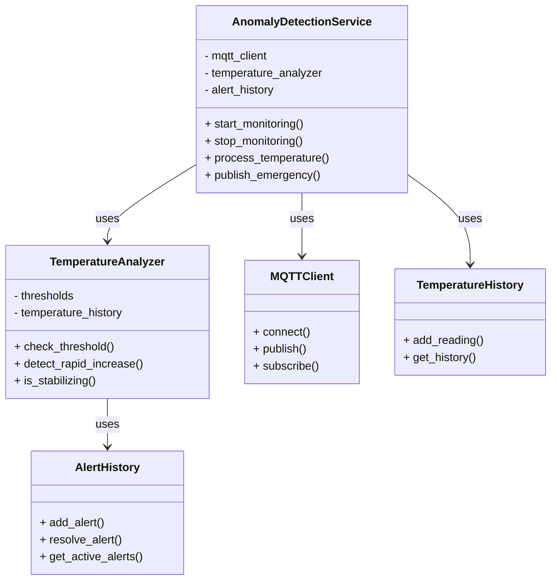

# Anomaly Detection Service


- [ ] table of contents

- [ ] local run
- [ ] local test
- [ ] docker run

## Table of Contents

## Architecture Position

The Anomaly Detection service operates as an MQTT-based microservice that:

- Subscribes to temperature data from room sensors and printers
- Analyzes temperature patterns for anomalies
- Publishes emergency alerts to the Fan Controller when critical conditions are detected

```text
┌─────────────────┐    MQTT Topics      ┌─────────────────┐
│  Room Sensor    │ ──────────────────► │   Anomaly       │
│                 │ device/room/temp    │   Detection     │
└─────────────────┘                     │                 │
                                        │                 │
┌─────────────────┐    MQTT Topics      │                 │
│  3D Printers    │ ──────────────────► │                 │
│                 │ device/printer/     │                 │
└─────────────────┘ {id}/temperature    └─────────────────┘
                                                │ MQTT Topics
                                                │ Emergency Alerts
                                                │ device/fan/
                                                │ controller/emergency
                                                ▼
                                        ┌─────────────────┐
                                        │  Fan Controller │
                                        │                 │
                                        └─────────────────┘
```

## Communication Protocols

### MQTT Subscriptions

#### Room Temperature Data Input

- **Topic**: `device/room/temperature`
- **Type**: 2.1.2) TemperatureReading
- **Purpose**: Monitor room temperature

#### Printer Temperature Data Input

- **Topic**: `device/printer/{printerId}/temperature`
- **Type**: 2.1.2) TemperatureReading
- **Purpose**: Monitor individual printer temperatures

### MQTT Publications

#### Emergency Alerts

- **Topic**: `device/fan/controller/emergency`
- **Type**: 2.4.3) EmergencyCommand
- **Purpose**: Trigger emergency fan control
- **QoS**: 2 (emergency and safety critical)

Types defined in [communication.md](../communication.md):

## Anomaly Detection Features

### Temperature Thresholds

- **Room Temperature**: Monitors for overheating conditions imposing a maximum value and increase rate threshold
- **Printer Temperature**: Monitors for overheating conditions imposing a maximum value and increase rate threshold
- **Configurable Limits**: Thresholds can be adjusted via configuration file (`anomaly_detection_config.yaml`)
- **Rate of Change**: Monitors rapid temperature increases (exploiting historical data)

### Emergency Handling

- **Emergency Finished**: Indicates that the emergency condition has been resolved

### Emergency history

- **Alert History**: Maintains a history of all emergency alerts triggered
- **Alert Resolution**: Tracks resolution of emergency conditions

## Journey

The Anomaly Detection Service follows a continuous monitoring and analysis workflow:

### 1. Initialization Phase

- Load configuration file with temperature thresholds and alert parameters
- Initialize MQTT client and connect to broker
- Subscribe to temperature data topics from room sensors and printers
- Initialize **temperature analyzer** with configured thresholds
- Set up alert history tracking

### 2. Data Collection Phase

- **Room Temperature Monitoring**: Continuously receive temperature readings
- **Printer Temperature Monitoring**: Continuously receive temperature readings
- **Data Validation**: Validate incoming sensor readings for accuracy and completeness
- **Temperature Logging**: Store temperature readings with timestamps for historical analysis

### 3. Analysis Phase

- **Threshold Printer Monitoring**: Check current temperatures against configured maximum limits
- **Threshold Room Monitoring**: Check current room temperature against configured maximum limits
- **Rate Analysis (printer)**: Monitor printer temperature change rates to detect potential equipment failures

### 4. Alert Generation Phase

- **Critical Condition Detection**: Identify when temperatures exceed safe operating limits
- **Alert Creation**: Generate appropriate emergency commands with related sources

### 5. Emergency Response Phase

- **Immediate Action**: Publish emergency commands
- **Alert Logging**: Record all alerts (for audit trail)

### 6. Recovery Monitoring

- **Condition Tracking**: Monitor temperature trends post-emergency
- **Alert Resolution**: Log successful resolution of emergency conditions
- **System De-escalation**: Revoke emergency commands once conditions stabilize

## Service Class Structure

### Separation of Concerns

The anomaly detection service is organized into several key classes:

- **AnomalyDetectionService**  
  Main service class. Handles:
  - Initialization of MQTT client, publisher, and subscriber
  - Discovery of printers on the network
  - Processing of incoming temperature readings (room and printer)
  - Detection of threshold and rate anomalies using TemperatureAnalyzer
  - Publishing emergency alerts and resolutions to MQTT topics
  - Hysteresis-based emergency resolution logic
  - Periodic CSV dump of temperature and alert history
  - Service lifecycle (start, stop, connect, disconnect)

- **TemperatureAnalyzer**  
  Performs all temperature analysis:
  - Checks if readings exceed configured thresholds
  - Detects rapid temperature increases (rate anomalies)
  - Maintains temperature history for each device
  - Determines if temperature is stabilizing after an emergency

- **MQTTClient**  
  Manages MQTT connections:
  - Connects to broker
  - Publishes and subscribes to topics
  - Handles message validation

- **AlertHistory**  
  - Stores and manages emergency alerts
  - Tracks active and resolved alerts

- **TemperatureHistory**  
  Stores historical temperature readings

## Class Diagram



## Folder Structure

```text
anomaly_detection/
├── app/
│   ├── /models                 # Data models 
│   │   └── emergency_model.py  # Emergency alert data model
│   │
│   ├── dto/   # Data Transfer Objects (MQTT schemas)
│   │   ├── temperature_reading_room_dto.py
│   │   ├── temperature_reading_printer_dto.py
│   │   └── emergency_command_dto.py
│   │
│   ├── classes/                  # Core logic classes
│   │   ├── anomaly_detection_service.py
│   │   └── temperature_analyzer.py
│   |
│   ├── mqtt/                       # MQTT client, publisher, subscriber
│   │   ├── mqtt_client.py
│   │   ├── subscriber.py
│   │   └── publisher.py
│   │
│   ├── persistence/
│   │   ├── alert_history.py       # Store alert history
│   │   └── temperature_history.py  # Store and retrieve temperature readings
│   │
│   ├── services/
│   │   └── discover_printers.py    # Service to discover printers on the network
│   │
│   ├── main.py                        # Service entrypoint
│   ├── anomaly_detection_config.yaml  # Anomaly detection configuration
│   └── mqtt_config.yaml               # MQTT configuration file for local run
│
├── target_mqtt_config.yaml            # MQTT configuration file for docker
│
├── requirements.txt
├── Dockerfile
├── README.md
│
└── tests/                            # Unit tests
    |
    ├── tester_mqtt_anomaly_hear.py
    ├── tester_mqtt_anomaly.py
    └── tester_mqtt_single_anomaly.py
```

- **app/**  
  Main application code.
  - **models/**: Data models, e.g., `emergency_model.py` for emergency alert objects.
  - **dto/**: Data Transfer Objects for MQTT messages, e.g., temperature readings and emergency commands.
  - **classes/**: Core logic classes, including `anomaly_detection_service.py` (main service logic) and `temperature_analyzer.py` (analysis algorithms).
  - **mqtt/**: MQTT client, publisher, and subscriber implementations.
  - **persistence/**: Handles alert history (`alert_history.py`) and temperature history (`temperature_history.py`).
  - **services/**: Utility modules, e.g., `discover_printers.py` for printer discovery.
  - **main.py**: Service entrypoint.
  - **anomaly_detection_config.yaml**: Configuration for anomaly detection thresholds.
  - **mqtt_config.yaml**: MQTT broker/topic configuration for local run.

- **target_mqtt_config.yaml**  
  MQTT configuration for Docker deployment.
- **tests/**  
  Unit and integration test scripts, including MQTT anomaly testers.
  - **tester_mqtt_anomaly_hear.py**: Tests file for subscribe and print the emergency alerts.
  - **tester_mqtt_anomaly.py**: Tests for anomaly detection service, publishing temperature readings and subscribing (printing) to alerts.
  - **tester_mqtt_single_anomaly.py**: Tests for single anomaly printer, publishing temperature readings.

## Local

### Local Run

Move to the `anomaly_detection` directory:

```bash
cd IoT_Project/anomaly_detection
```

Install dependencies:

```bash
pip install -r requirements.txt
```

Run the service locally:

```bash
python3 -m app.main
```

### Local Test

To run unit tests (assuming you have the requirements installed):

```bash
cd IoT_Project/anomaly_detection/tests
python3 tester_mqtt_anomaly.py
```

You can also run:

```bash
python3 tester_mqtt_anomaly_hear.py
python3 tester_mqtt_single_anomaly.py
```

#### tester_mqtt_anomaly.py

- Publishes random temperature readings for both room and 3 printers, and subscribes to emergency alerts.
- Purpose: **generic integration test** for anomaly detection service.

#### tester_mqtt_anomaly_hear.py

- Subscribes to the emergency alert topic and prints any received alerts.
- Purpose: **Monitor and debug emergency alert publication**.

#### tester_mqtt_single_anomaly.py

- Publishes temperature readings for a single printer and a single room simulating a thermal runaway and overheating (without subscribing to alerts).
- Purpose: Isolate and test anomaly detection for individual devices, showing the **emergency creation and handling**.

## Docker

Build the Docker image:

```bash
docker build -t anomaly_detection-image .
```

Run the container:

```bash
docker run --name anomaly_detection-container \
    -p 8140:8140 \
    -v ${PWD}/target_mqtt_config.yaml:/app/mqtt_config.yaml \
    -v ${PWD}/app/persistence/save/alert_history.csv:/app/persistence/save/alert_history.csv \
    -v ${PWD}/app/persistence/save/temperature_history.csv:/app/persistence/save/temperature_history.csv \
    --network composed-mqtt-project_iot_network \
    --restart always \
    anomaly_detection-image
```

- `-d`: Runs the container in detached mode, for debugging purposes is not included.
- `--name anomaly_detection-container`: Names the container for easy reference.
- `-p 8140:8140`: Maps the container’s port 8140 to the host, as defined in the flowchart.
- `-v ...`: Mounts configuration and persistence files for alerts and temperature history.
- `--network composed-mqtt-project_iot_network`: Connects the container to the project’s Docker network for MQTT communication.
- `--restart always`: Ensures the container restarts automatically if stopped.
- `anomaly_detection-image`: The Docker image to use.

The service will be available at [http://localhost:8140](http://localhost:8140) if it exposes an HTTP API.

To stop and remove the container:

```bash
docker stop anomaly_detection-container
docker rm anomaly_detection-container
```

To view logs:

```bash
docker logs anomaly_detection-container
```

To enter the container for debugging:

```bash
docker exec -it anomaly_detection
```

## Docker Compose

Follow the main readme instructions in the root directory of the project. ([main readme](../README.md))
