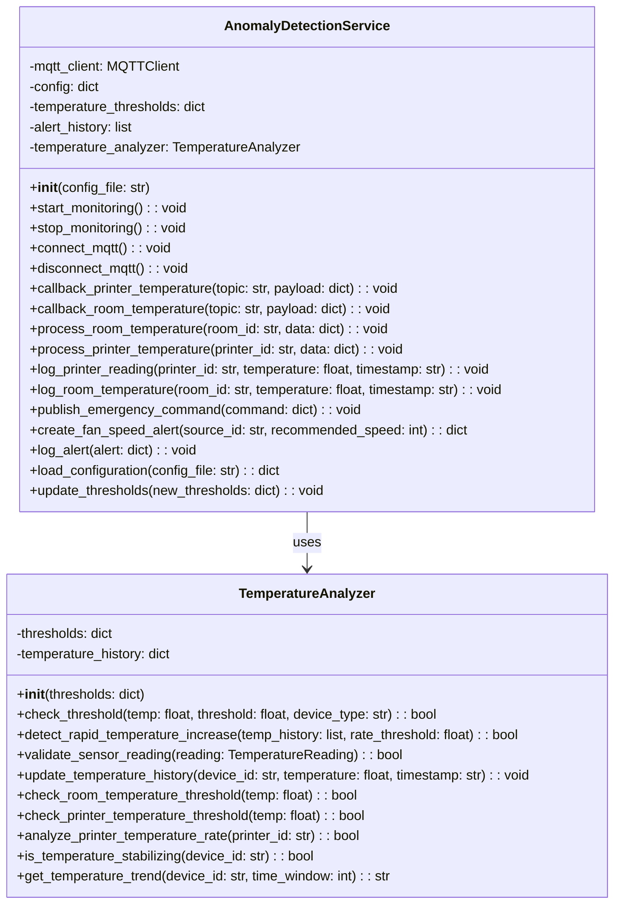

# Anomaly Detection Service

## Architecture Position

The Anomaly Detection service operates as an MQTT-based microservice that:

- Subscribes to temperature data from room sensors and printers
- Analyzes temperature patterns for anomalies
- Publishes emergency alerts to the Fan Controller when critical conditions are detected

```text
┌─────────────────┐    MQTT Topics      ┌─────────────────┐
│  Room Sensor    │ ──────────────────► │   Anomaly       │
│                 │ device/room/temp    │   Detection     │
└─────────────────┘                     │                 │
                                        │                 │
┌─────────────────┐    MQTT Topics      │                 │
│  3D Printers    │ ──────────────────► │                 │
│                 │ device/printer/     │                 │
└─────────────────┘ {id}/temperature    └─────────────────┘
                                                │ MQTT Topics
                                                │ Emergency Alerts
                                                │ device/fan/
                                                │ controller/emergency
                                                ▼
                                        ┌─────────────────┐
                                        │  Fan Controller │
                                        │                 │
                                        └─────────────────┘
```

## Communication Protocols

### MQTT Subscriptions

#### Temperature Data Input

- **Topic**: `device/room/temperature`
- **Type**: 2.1.2) TemperatureReading
- **Purpose**: Monitor room temperature for overheating conditions

- **Topic**: `device/printer/{printerId}/temperature`
- **Type**: 2.1.2) TemperatureReading
- **Purpose**: Monitor individual printer temperatures for anomalies

### MQTT Publications

#### Emergency Alerts

- **Topic**: `device/fan/controller/emergency`
- **Type**: 2.4.3) EmergencyCommand
- **Purpose**: Trigger emergency fan control or system shutdown

Types defined in [communication.md](../communication.md):

## Anomaly Detection Features

### Temperature Thresholds

- **Room Temperature**: Monitors for overheating conditions imposing a maximum threshold (conf_file)
- **Printer Temperature**: Detects thermal runaway and overheating conditions imposing maximum thresholds (conf_file)
- **Configurable Limits**: Detects increasing temperature rates that indicate potential thermal runaway (conf_file)

## Journey

The Anomaly Detection Service follows a continuous monitoring and analysis workflow:

### 1. Initialization Phase

- Load configuration file with temperature thresholds and alert parameters
- Initialize MQTT client and connect to broker
- Subscribe to temperature data topics from room sensors and printers
- Initialize **temperature analyzer** with configured thresholds
- Set up alert history tracking

### 2. Data Collection Phase

- **Room Temperature Monitoring**: Continuously receive temperature readings
- **Printer Temperature Monitoring**: Continuously receive temperature readings
- **Data Validation**: Validate incoming sensor readings for accuracy and completeness
- **Temperature Logging**: Store temperature readings with timestamps for historical analysis

### 3. Analysis Phase

- **Threshold Printer Monitoring**: Check current temperatures against configured maximum limits
- **Threshold Room Monitoring**: Check current room temperature against configured maximum limits
- **Rate Analysis (printer)**: Monitor printer temperature change rates to detect potential equipment failures

### 4. Alert Generation Phase

- **Critical Condition Detection**: Identify when temperatures exceed safe operating limits
- **Emergency Classification**: Determine severity level of detected anomalies
- **Alert Creation**: Generate appropriate emergency commands with recommended actions

### 5. Emergency Response Phase

- **Immediate Action**: Publish emergency commands
- **Alert Logging**: Record all alerts and actions taken for audit trail

### 6. Recovery Monitoring

- **Condition Tracking**: Monitor temperature trends post-emergency
- **System Stabilization**: Ensure temperatures return to safe operating ranges
- **Alert Resolution**: Log successful resolution of emergency conditions
- **System De-escalation**: Revoceke emergency commands once conditions stabilize

## Separation of Concerns

The architecture follows a clear separation where:

- AnomalyDetectionService handles external interactions:
  - MQTT subscriptions
  - loading configuration
  - logging (temperature readings and alerts)
  - emergency command publications

- TemperatureAnalyzer handles mathematical and logical analysis of temperature data:
  - threshold checks
  - rate of change analysis
  - temperature history management
  - validation of sensor readings
  - emergency re-entrance

## Service Class Structure


