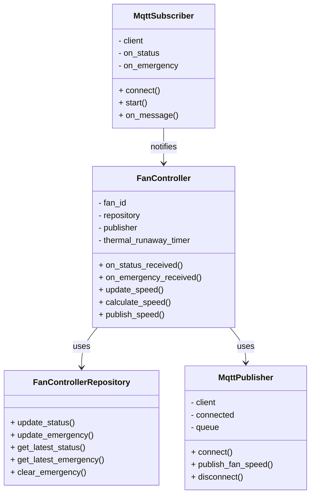

# Fan Controller Service

## Table of Contents

1. [Architecture Position](#architecture-position)
2. [Communication Protocols](#communication-protocols)
    - [MQTT Subscriptions](#mqtt-subscriptions)
    - [MQTT Publications](#mqtt-publications)
3. [Fan Control Features](#fan-control-features)
4. [Journey](#journey)
5. [Service Class Structure](#service-class-structure)
6. [Class Diagram](#class-diagram)
7. [Folder Structure](#folder-structure)
8. [Local](#local)
    - [Local Run](#local-run)
    - [Local Test](#local-test)
9. [Docker](#docker)
10. [Docker Compose](#docker-compose)

## Architecture Position

The Fan Controller service operates as an MQTT-based microservice that:

- Subscribes to temperature status updates from Global Temperature service
- Receives emergency alerts from Anomaly Detection service
- Controls fan speed based on temperature conditions and emergency situations
- Publishes fan speed commands to physical fan units

```text
┌─────────────────┐    MQTT Topics      ┌─────────────────┐
│  Global         │ ──────────────────► │   Fan           │
│  Temperature    │ device/fan/         │   Controller    │
└─────────────────┘ controller/status   │                 │
                                        │                 │
┌─────────────────┐    MQTT Topics      │                 │
│  Anomaly        │ ──────────────────► │                 │
│  Detection      │ device/fan/         │                 │
└─────────────────┘ controller/emergency └─────────────────┘
                                                │ MQTT Topics
                                                │ Fan Speed Commands
                                                │ device/fan/
                                                │ {fanId}/speed
                                                ▼
                                        ┌─────────────────┐
                                        │  Fan Units      │
                                        │                 │
                                        └─────────────────┘
```

## Communication Protocols

### MQTT Subscriptions

#### Temperature Status Input

- **Topic**: `device/fan/controller/status`
- **Type**: 2.4.1) FanControllerTemp
- **Purpose**: Receive heat level updates from Global Temperature service
- **QoS**: 0 (periodic updates, loss acceptable)

#### Emergency Alert Input

- **Topic**: `device/fan/controller/emergency`
- **Type**: 2.4.3) EmergencyCommand
- **Purpose**: Receive critical alerts from Anomaly Detection service
- **QoS**: 2 (emergency and safety critical)

### MQTT Publications

#### Fan Speed Commands

- **Topic**: `device/fan/{fanId}/speed`
- **Type**: 2.4.2) FanSpeed
- **Purpose**: Control physical fan units
- **QoS**: 1 (important control commands)

Types defined in [communication.md](../communication.md):

## Fan Control Features

### Temperature-Based Control

- **Heat Level Processing**: Converts heat levels (0-10) to fan speeds (0-100%)
- **Proportional Control**: Fan speed = heatLevel × 10, clamped to 0-100 range
- **Continuous Monitoring**: Responds to periodic temperature status updates

### Emergency Response

- **Overheat Protection**: Sets fan to maximum speed (100%) for overheat conditions
- **Thermal Runaway Handling**: Maximum speed for 30 seconds, then automatic reset
- **Shutdown Commands**: Immediately stops fan when action is "shutdown"
- **Emergency Resolution**: Returns to normal operation when emergency is "solved"

### Multi-Fan Support

- **Configurable Fans**: Supports multiple fan units via configuration file
- **Individual Control**: Each fan can be controlled separately
- **Broadcast Mode**: Status/emergency updates without fanId apply to all fans

### Safety Features

- **Emergency Priority**: Emergency commands always override temperature-based control
- **Timer Management**: Automatic thermal runaway timer with 30-second duration
- **State Persistence**: Maintains current status and emergency states

## Journey

The Fan Controller Service follows a reactive control and safety workflow:

### 1. Initialization Phase

- Load configuration file with fan definitions and MQTT settings
- Initialize MQTT client and connect to broker
- Subscribe to temperature status and emergency alert topics
- Create **fan controller instances** for each configured fan
- Initialize **repository** for state management

### 2. Status Monitoring Phase

- **Heat Level Reception**: Continuously receive temperature status updates
- **Status Validation**: Validate incoming heat level data (0-10 range)
- **State Storage**: Store latest temperature status in repository
- **Speed Calculation**: Calculate appropriate fan speed based on heat level

### 3. Emergency Response Phase

- **Alert Processing**: Receive and validate emergency alerts
- **Emergency Classification**: Process different emergency types (overheat, thermal_runaway, solved)
- **Immediate Action**: Override normal operation for emergency situations
- **Timer Management**: Start thermal runaway timer for temporary emergency conditions

### 4. Fan Control Phase

- **Speed Determination**: Calculate fan speed based on current status and emergency state
- **Command Generation**: Create fan speed DTOs with target speed and timestamps
- **MQTT Publication**: Publish speed commands to individual fan units
- **State Logging**: Log all speed changes and control decisions

### 5. Emergency Resolution Phase

- **Solved Processing**: Handle emergency resolution messages
- **State Clearing**: Clear emergency conditions and return to normal operation
- **Timer Cleanup**: Cancel active timers and reset emergency states
- **Normal Resumption**: Resume temperature-based control

### 6. Continuous Operation

- **State Monitoring**: Continuously monitor for status and emergency updates
- **Priority Management**: Ensure emergency commands always take precedence
- **Safety Compliance**: Maintain safe operation through all conditions

## Service Class Structure

### Separation of Concerns

The fan controller service is organized into several key classes:

- **FanController**
  Main controller class for individual fans. Handles:
  - Processing incoming status messages (heat level updates)
  - Processing incoming emergency messages (overheat, thermal runaway, solved)
  - Speed calculation based on current status and emergency conditions
  - Publishing fan speed commands to MQTT topics
  - Managing thermal runaway timer for temporary emergency conditions
  - State management integration with repository

- **MqttSubscriber**  
  Manages inbound MQTT communications:
  - Subscribes to status and emergency topics
  - Handles connection management and message routing
  - Dispatches messages to appropriate fan controllers

- **MqttPublisher**  
  Manages outbound MQTT communications:
  - Publishes fan speed commands to individual fan topics
  - Handles connection management and message queuing
  - Ensures reliable delivery of control commands

- **FanControllerRepository**  
  Manages state persistence and data access:
  - Stores latest temperature status for each fan
  - Manages emergency state and history
  - Provides state query and update methods

## Class Diagram



## Folder Structure

```text
fan_controller/
├── app/
│   ├── model/                     # Core business logic
│   │   └── status.py              # FanController main class
│   │
│   ├── dto/                       # Data Transfer Objects (MQTT schemas)
│   │   ├── status_dto.py          # Temperature status data
│   │   ├── emergency_dto.py       # Emergency alert data
│   │   └── fan_speed_dto.py       # Fan speed command data
│   │
│   ├── mqtt/                      # MQTT communication layer
│   │   ├── subscriber.py          # MQTT message subscription
│   │   └── publisher.py           # MQTT message publishing
│   │
│   ├── persistence/
│   │   └── repository.py          # State management and persistence
│   │
│   └── main.py                    # Service entrypoint
│
├── config/
│   ├── fan_controller_config.yaml # Service configuration
│   └── tests/                     # Test configurations and integration tests
│       └── test_publisher_integration.py
│
├── config.yaml/                   # Additional configuration directory
│
├── requirements.txt
├── Dockerfile
└── README.md                      # This documentation file
```

- **app/**  
  Main application code.
  - **model/**: Core business logic, including `status.py` (main FanController class).
  - **dto/**: Data Transfer Objects for MQTT messages, including status updates, emergency alerts, and fan speed commands.
  - **mqtt/**: MQTT communication layer with subscriber and publisher implementations.
  - **persistence/**: Repository pattern implementation for state management.
  - **main.py**: Service entrypoint with configuration loading and fan controller management.

- **config/**  
  Configuration files for fan definitions, MQTT settings, and test configurations.

## Local

### Local Run

Move to the `fan_controller` directory:

```bash
cd IoT_Project/fan_controller
```

Install dependencies:

```bash
pip install -r requirements.txt
```

Run the service locally:

```bash
python3 -m app.main
```

For test mode (simulates status and emergency messages):

```bash
python3 -m app.main --test
```

### Local Test

#### Test Mode

The service includes a built-in test mode that simulates status and emergency messages:

```bash
python3 -m app.main --test
```

This will:
- Create fan controllers based on configuration
- Simulate status messages with heat level 5
- Simulate emergency messages of type "overheat"
- Display the calculated fan speeds and MQTT messages

#### MQTT Subscriber Testing

You can test the MQTT subscriber independently:

```bash
cd IoT_Project/fan_controller/app/mqtt
python3 subscriber.py
```

This will:
- Connect to the MQTT broker
- Subscribe to status and emergency topics
- Print received messages for debugging

#### Integration Testing

Refer to [`config/tests/test_publisher_integration.py`](config/tests/test_publisher_integration.py) for publisher integration tests.

#### Manual Testing

You can manually test the service by:

1. Publishing status messages to `device/fan/controller/status`:
   ```json
   {"heatLevel": 7, "timestamp": "2025-07-23T10:00:00Z"}
   ```

2. Publishing emergency messages to `device/fan/controller/emergency`:
   ```json
   {
     "action": "max_speed",
     "type": "overheat",
     "source": "printer",
     "id": "printer-1",
     "timestamp": "2025-07-23T10:01:00Z"
   }
   ```

3. Monitoring fan speed output on `device/fan/{fanId}/speed`

## Docker

Build the Docker image:

```bash
docker build -t fan-controller-image .
```

Run the container:

```bash
docker run --name fan-controller-container \
    -v ${PWD}/config/fan_controller_config.yaml:/app/config/fan_controller_config.yaml \
    --network composed-mqtt-project_iot_network \
    --restart always \
    fan-controller-image
```

- `--name fan-controller-container`: Names the container for easy reference.
- `-v ...`: Mounts configuration file for customization.
- `--network composed-mqtt-project_iot_network`: Connects the container to the project's Docker network for MQTT communication.
- `--restart always`: Ensures the container restarts automatically if stopped.
- `fan-controller-image`: The Docker image to use.

To stop and remove the container:

```bash
docker stop fan-controller-container
docker rm fan-controller-container
```

To view logs:

```bash
docker logs fan-controller-container
```

To enter the container for debugging:

```bash
docker exec -it fan-controller-container /bin/bash
```

## Docker Compose

Follow the main readme instructions in the root directory of the project. ([main readme](../README.md))

The Fan Controller service integrates with the complete system through Docker Compose, ensuring proper network connectivity with:

- **MQTT Broker**: For receiving status and emergency messages
- **Global Temperature**: For heat level updates
- **Anomaly Detection**: For emergency alerts
- **Fan Units**: For speed control commands

The service configuration supports multiple fans and can be customized through the mounted configuration file for different deployment scenarios.

**Key Configuration Options:**

- **Fan Definitions**: Configure multiple fans with unique IDs
- **MQTT Settings**: Broker connection and topic configuration
- **Emergency Handling**: Thermal runaway timer duration and behavior
- **Speed Calculation**: Heat level to