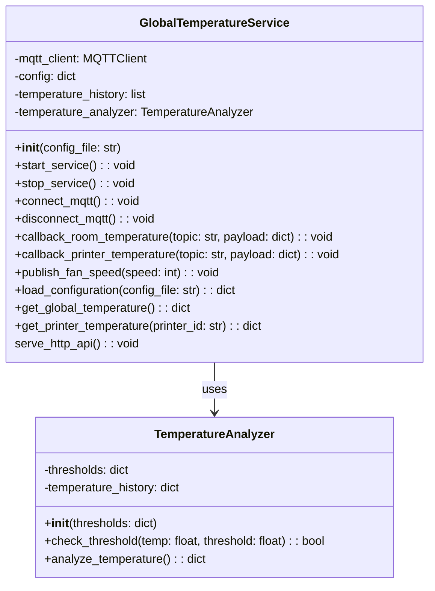

# Global Temperature Service

## Architecture Position

The Global Temperature service operates as a microservice that:

- aggregates and monitors temperature readings from both room sensors and individual 3D printers and stores them in a persistent database.
- provides real-time temperature data for web requests.
- computes a summary of the temperature readings for the room and each printer, and sends commands to a fan controller to communicate the need for cooling based on temperature analysis.

```text
┌─────────────────┐     HTTP Requests   ┌─────────────────┐
│   API gateway   │  ────────────────►  │                 │
│   (Web Browser) |  ◄────────────────  │                 │
└─────────────────┘     HTTP Responses  │                 │
                                        |                 │
┌──────────────────┐    MQTT Topics     │     Global      │
│ Room Temp Sensor │ ─────────────────► │  Temperature    │
│                  │ device/room/       │    Service      │
│                  │ temperature        │                 │
└──────────────────┘                    │                 │
                                        │                 │
┌──────────────────┐    MQTT Topics     │                 │
│   ST Printer     │ ─────────────────► │                 │
│                  │ device/printer/    │                 │
│                  │ {id}/temperature   │                 │
└──────────────────┘                    └─────────────────┘
                                                │
                                                │ MQTT Topics
                                                │ device/fan/controller/status
                                                │
                                                ▼
                                        ┌──────────────────┐
                                        │ Fan Controller   │
                                        └──────────────────┘
```

## Communication Protocols

### MQTT Subscriptions

#### Room Temperature

- **Topic**: `device/room/temperature`
- **Type**: 2.1.1) TemperatureReadingRoom
- **Purpose**: Receive room temperature readings for monitoring
- **QoS**: QoS 0

#### Printer Temperature

- **Topic**: `device/printer/{printerId}/temperature`
- **Type**: 2.1.2) TemperatureReadingPrinter
- **Purpose**: Receive individual printer temperature readings
- **QoS**: QoS 1

### MQTT Publications

#### Fan Speed Command

- **Topic**: `device/fan/controller/status`
- **Type**: 2.4.1) FanControllerTemp
- **Purpose**: Periodic heat communication level based on temperature analysis
- **QoS**: QoS 0

### HTTP API - Responses - (through API Gateway)

#### Global Temperature Endpoint

- **Endpoint**: `/temperature/global`
- **Method**: 1.2.1) GET
- **Response**: List of all temperature readings (room and printers)

See [communication.md](../communication.md) for full message schemas.

## Service Features

### Temperature Aggregation

- Collects temperature readings from all sources (room and printers)
- Maintains a history of temperature data for analysis on a persistent database

### Fan Communication

- Publishes a heat level to the fan controller based on temperature analysis
- It's a overall temperature level that indicates the need for cooling, **not emergency cooling**.
- The commmunication is periodic, not event-driven.

### API Integration

- Provides HTTP endpoint for retrieving all temperature data

### Configurations file

- Loads configurations on how define the heat level for the fan controller.
- Load configurations for MQTT broker connection.

## Journey

The Global Temperature Service follows this workflow:

1. **Initialization Phase**
    - Load configuration and thresholds
    - Connect to MQTT broker
    - Subscribe to temperature topics
    - Initialize temperature history and analyzer

2. **Data Collection Phase**
    - Aggregate temperature readings from room and printers
    - Store readings in temperature history

3. **Heat Level Computation Phase**
    - Compute the heat level for the fan controller based on temperature analysis

4. **API Serving Phase**
    - Serve temperature data via HTTP endpoint

## Separation of Concerns

- **GlobalTemperatureService**: Handles MQTT subscriptions, temperature aggregation, fan control logic, and HTTP API.
- **TemperatureAnalyzer**: Performs threshold checks and analysis.

## Service Class Structure


