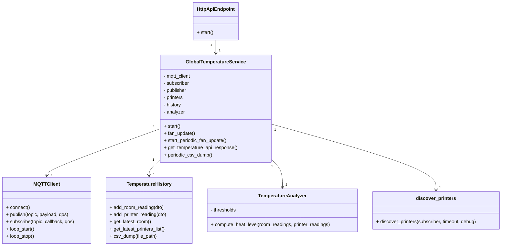

# Global Temperature Service

## Table of Contents

- [Architecture Position](#architecture-position)
- [Communication Protocols](#communication-protocols)
  - [MQTT Subscriptions](#mqtt-subscriptions)
  - [MQTT Publications](#mqtt-publications)
  - [HTTP API - Responses](#http-api---responses---through-api-gateway)
- [Service Features](#service-features)
  - [Temperature Aggregation](#temperature-aggregation)
  - [Fan Communication](#fan-communication)
  - [Temperature Analysis](#temperature-analysis)
  - [API Integration](#api-integration)
  - [Configurations file](#configurations-file)
- [Journey](#journey)
- [Separation of Concerns](#separation-of-concerns)
- [Service Class Structure](#service-class-structure)
- [Folder Structure](#folder-structure)
- [Local](#local)
  - [Local run](#local-run)
  - [Local test](#local-test)
- [Docker](#docker)
  - [Docker run](#docker-run)
  - [Docker Compose](#docker-compose)
  
## Architecture Position

The Global Temperature service operates as a microservice that:

- aggregates and monitors temperature readings from both room sensors and individual 3D printers and stores them in a persistent database.
- provides real-time temperature data for web requests.
- computes a summary of the temperature readings for the room and each printer, and sends commands to a fan controller to communicate the need for cooling based on temperature analysis.

```text
┌─────────────────┐     HTTP Requests   ┌─────────────────┐
│   API gateway   │  ────────────────►  │                 │
│   (Web Browser) |  ◄────────────────  │                 │
└─────────────────┘     HTTP Responses  │                 │
                                        |                 │
┌──────────────────┐    MQTT Topics     │     Global      │
│ Room Temp Sensor │ ─────────────────► │  Temperature    │
│                  │ device/room/       │    Service      │
│                  │ temperature        │                 │
└──────────────────┘                    │                 │
                                        │                 │
┌──────────────────┐    MQTT Topics     │                 │
│   ST Printer     │ ─────────────────► │                 │
│                  │ device/printer/    │                 │
│                  │ {id}/temperature   │                 │
└──────────────────┘                    └─────────────────┘
                                                │
                                                │ MQTT Topics
                                                │ device/fan/controller/status
                                                │
                                                ▼
                                        ┌──────────────────┐
                                        │ Fan Controller   │
                                        └──────────────────┘
```

## Communication Protocols

### MQTT Subscriptions

#### Room Temperature

- **Topic**: `device/room/temperature`
- **Type**: 2.1.1) TemperatureReadingRoom
- **Purpose**: Receive room temperature readings for monitoring
- **QoS**: QoS 0

#### Printer Temperature

- **Topic**: `device/printer/{printerId}/temperature`
- **Type**: 2.1.2) TemperatureReadingPrinter
- **Purpose**: Receive individual printer temperature readings
- **QoS**: QoS 1

### MQTT Publications

#### Fan Speed Command

- **Topic**: `device/fan/controller/status`
- **Type**: 2.4.1) FanControllerTemp
- **Purpose**: Periodic heat communication level based on temperature analysis
- **QoS**: QoS 0

### HTTP API - Responses - (through API Gateway)

#### Global Temperature Endpoint

- **Endpoint**: `/temperature/global`
- **Method**: 1.2.1) GET
- **Response**: List of all temperature readings (room and printers)

See [communication.md](../communication.md) for full message schemas.

## Service Features

### Temperature Aggregation

- Collects temperature readings from all sources (room and printers)
- Maintains a history of temperature data for analysis on a persistent database

### Fan Communication

- Publishes a heat level to the fan controller based on temperature analysis
- It's a overall temperature level that indicates the need for cooling, **not emergency cooling**.
- The communication is periodic, not event-driven.

### Temperature Analysis

- Analyzes temperature readings against predefined thresholds defined in the configuration file [`config.global_temperature_config.yaml`](global_temperature_config.yaml) in a scale 1 to 10.
- Determines the heat level for the fan controller based on the following analysis:

  - Computes the average temperature of all printers and maps it to a heat level, based on the thresholds.
  - From the room temperature, it computes the heat level based on the thresholds.
  - Then it combines the two heat levels to determine the overall heat level, 70% of the room temperature and 30% of the average printer temperature.

### API Integration

- Provides HTTP endpoint for retrieving all temperature data

### Configurations file

- Loads configurations on how define the heat level for the fan controller.
- Load configurations for MQTT broker connection.

## Journey

The Global Temperature Service follows this workflow:

1. **Initialization Phase**
    - Load configuration and thresholds
    - Connect to MQTT broker
    - Subscribe to temperature topics
    - Initialize temperature history and analyzer

2. **Data Collection Phase**
    - Aggregate temperature readings from room and printers
    - Store readings in temperature history

3. **Heat Level Computation Phase**
    - Compute the heat level for the fan controller based on temperature analysis

4. **API Serving Phase**
    - Serve temperature data via HTTP endpoint

## Separation of Concerns

- **GlobalTemperatureService**: Handles MQTT subscriptions, temperature aggregation, fan control logic, and HTTP API.
- **TemperatureAnalyzer**: Performs threshold checks and analysis.

## Service Class Structure



**Division of concerns:**

- `GlobalTemperatureService` is the main orchestrator, handling MQTT, aggregation, analysis, and API.
- `TemperatureAnalyzer` computes the heat level for the fan controller.
- `TemperatureHistory` stores and retrieves temperature readings.
- `MQTTClient`, `MQTTSubscriber`, and `MQTTPublisher` handle MQTT communication.
- `HttpApiEndpoint` exposes the HTTP API.
- `discover_printers` utility discovers available printers via MQTT.

This structure reflects the separation of concerns and main interactions in the service.

## Folder Structure

```text
global_temperature/
├── app/
│   ├── dto/                # Data Transfer Objects (DTOs) for MQTT/HTTP messages
│   │   
│   ├── http/               # HTTP API endpoint logic (Flask)
│   │   
│   ├── models/             # Core service classes:
│   │   ├── global_temperature_service.py   # Main service: aggregation, MQTT, API, fan control
│   │   └── temperature_analyzer.py        # Analysis logic: thresholds, heat level computation
│   │   
│   ├── mqtt/               # MQTT client, publisher, subscriber logic
│   │   
│   ├── persistence/        # Temperature history and CSV persistence
│   │   └── temperature_history.py          # Temperature history management
│   │   
│   ├── services/           # Utility services:
│   │   └── discover_printers.py           # Printer discovery and management
│   │
│   ├── main.py             # Main entry point for the service
│   |
│   ├── global_temperature_config.yaml  # Heat level thresholds/config
│   ├── mqtt_config.yaml    # MQTT broker/topic configuration
│   └── web_config.yaml     # Web API configuration
│
├── Dockerfile              # Docker build instructions
├── README.md               # Service documentation
├── requirements.txt        # Python dependencies
│
├── target_mqtt_config.yaml # Docker-specific MQTT config
├── target_web_config.yaml  # Docker-specific web config
├── target_web_conf.yaml    # Alternate web config
│
└── tests/
    ├── tester_http_global_temperature.py   # HTTP endpoint test script
    └── tester_mqtt_global_temperature.py   # MQTT pub/sub test script
```

- The `app/` directory contains all service logic, organized by responsibility:
  - `dto/` holds message/data schemas for MQTT and HTTP communication.
  - `http/` implements the HTTP API endpoint (Flask).
  - `models/` contains the main business logic:
    - `global_temperature_service.py` orchestrates MQTT subscriptions, temperature aggregation, analysis, fan control, and API integration.
    - `temperature_analyzer.py` handles heat level computation using configurable thresholds.
  - `mqtt/` provides MQTT client, publisher, and subscriber implementations for messaging.
  - `persistence/` manages temperature history and CSV export for analysis and backup.
    - `temperature_history.py` stores and retrieves temperature readings.
  - `services/` includes utility modules
    - `discover_printers.py` implements dynamic printer discovery via MQTT.
  - Configuration files (`*_config.yaml`) allow flexible setup for temperature thresholds, MQTT broker, and web API for local environment.
  - Configuration files are also provided for Docker deployment (`target_mqtt_config.yaml`, `target_web_config.yaml`).
  - Containerization files (`Dockerfile`, `requirements.txt`) enable easy deployment in Docker environments.
  - `main.py` is the entry point for launching the service.

## Local

### Local run

Move to the `global_temperature` directory:

Install the dependencies prensent in the `requirements.txt`.

Run the service with:

```bash
python3 -m app.main
```

### Local test

Run the mqtt tests (remember to launche the broker) with:

```bash
pytest -v tests/tester_mqtt_global_temperature.py
```

It publishes the room and printer temperature readings (can adjust timing and which room/printer device) on the topics `device/room/temperature` and `device/printer/{printerId}/temperature`, and prints the fan controller status on the topic `device/fan/controller/status`.

Run the http tests with:

```bash
pytest -v tests/tester_http_global_temperature.py
```

Perform a http request to the endpoint `/temperature/global` and prints the response with all temperature readings (room and printers).

## Docker

### Docker run

To builfd the Docker image for the Global Temperature Service, navigate to the `global_temperature` directory and run the following command:

```bash
docker build -t global_temperature-image .
```

To run the Docker container, use the following command:

```bash
docker run --name global_temperature-container \
  -p 8100:8100 \
  -v ${PWD}/target_mqtt_config.yaml:/app/mqtt_config.yaml \
  -v ${PWD}/target_web_conf.yaml:/app/web_config.yaml \
  -v ${PWD}/app/persistence/save:/app/persistence/save \
  --network composed-mqtt-project_iot_network \
  --restart always \
  global_temperature-image
```

- `-v ${PWD}/target_mqtt_config.yaml:/app/mqtt_config.yaml`: Mounts the MQTT configuration file.
- `-v ${PWD}/target_web_conf.yaml:/app/web_config.yaml`: Mounts the web configuration file.
- `-v ${PWD}/app/persistence/save:/app/persistence/save`: Mounts the persistence directory for saving temperature data.
- `--network composed-mqtt-project_iot_network`: Connects the container to the specified Docker network.
- `--restart always`: Ensures the container restarts automatically if it stops or if the Docker daemon restarts.

## Docker Compose

Follow the main readme instructions in the root directory of the project. ([main readme](../README.md))
