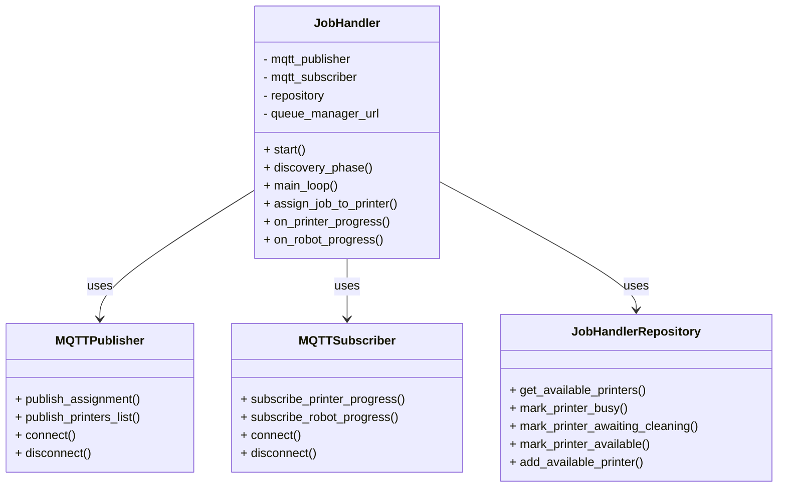

# Job Handler Service

## Table of Contents

1. [Architecture Position](#architecture-position)
2. [Communication Protocols](#communication-protocols)
    - [MQTT Subscriptions](#mqtt-subscriptions)
    - [MQTT Publications](#mqtt-publications)
    - [HTTP Communications](#http-communications)
3. [Job Management Features](#job-management-features)
4. [Journey](#journey)
5. [Service Class Structure](#service-class-structure)
6. [Class Diagram](#class-diagram)
7. [Folder Structure](#folder-structure)
8. [Local](#local)
    - [Local Run](#local-run)
    - [Local Test](#local-test)
9. [Docker](#docker)
10. [Docker Compose](#docker-compose)

## Architecture Position

The Job Handler service operates as a central orchestration microservice that:

- Manages the complete print job lifecycle from assignment to completion
- Coordinates communication between Priority Queue Manager, printers, and Robot Management
- Tracks printer availability and job status via MQTT
- Ensures efficient utilization of printing resources through intelligent job assignment

```text
┌─────────────────┐    HTTP API         ┌─────────────────┐
│  Priority       │ ──────────────────► │   Job Handler   │
│  Queue Manager  │ GET /prioritary_job │                 │
└─────────────────┘                     │                 │
                                        │                 │
┌─────────────────┐    MQTT Topics      │                 │
│  3D Printers    │ ──────────────────► │                 │
│                 │ device/printer/     │                 │
└─────────────────┘ {id}/progress       └─────────────────┘
                                                │ MQTT Topics
                                                │ Job Assignments
                                                │ device/printer/
                                                │ {id}/assignment
                                                ▼
                                        ┌─────────────────┐
                                        │  3D Printers    │
                                        │                 │
                                        └─────────────────┘
                                                │
                                                │ MQTT Topics
                                                │ Printer Status
                                                │ device/printers
                                                ▼
                                        ┌─────────────────┐
                                        │  Robot          │
                                        │  Management     │
                                        └─────────────────┘
                                                │ MQTT Topics
                                                │ Robot Progress
                                                │ device/robot/
                                                │ {id}/progress
                                                ▼
                                        ┌─────────────────┐
                                        │   Job Handler   │
                                        │   (Feedback)    │
                                        └─────────────────┘
```

## Communication Protocols

### MQTT Subscriptions

#### Printer Progress Data Input

- **Topic**: `device/printer/{printerId}/progress`
- **Type**: 2.3.3) PrinterProgressDTO
- **Purpose**: Monitor printer job progress and status changes
- **QoS**: 0 (frequent updates, loss acceptable)

#### Robot Progress Data Input

- **Topic**: `device/robot/{robotId}/progress`
- **Type**: 2.5.2) RobotProgressDTO
- **Purpose**: Monitor robot cleaning completion to mark printers as available
- **QoS**: 0 (frequent updates, loss acceptable)

### MQTT Publications

#### Job Assignments to Printers

- **Topic**: `device/printer/{printerId}/assignment`
- **Type**: 2.3.2) PrinterAssignmentDTO
- **Purpose**: Assign print jobs to available printers
- **QoS**: 1 (critical assignments must be delivered)

#### Printer Status Updates to Robot Management

- **Topic**: `device/printers`
- **Type**: 2.5.1) PrinterStatusListDTO
- **Purpose**: Notify Robot Management when printers need cleaning
- **QoS**: 0 (status updates, loss acceptable)

### HTTP Communications

#### Job Retrieval from Priority Queue Manager

- **Endpoint**: `GET {queue_manager_url}/prioritary_job`
- **Type**: JobDTO (Consumer pattern)
- **Purpose**: Retrieve highest priority job from queue
- **Method**: Consumer pattern (removes job from queue)

Types defined in [communication.md](../communication.md):

## Job Management Features

### Printer Discovery and Tracking

- **Discovery Phase**: Initial 10-second period to discover available printers from MQTT progress topics
- **Real-time Tracking**: Continuous monitoring of printer status (idle, printing, awaiting cleaning)
- **Availability Management**: Dynamic tracking of available printers for job assignment

### Job Assignment Logic

- **Priority-based Assignment**: Assigns highest priority jobs to available printers
- **Resource Optimization**: Only assigns jobs when both printer and robot resources are available
- **Assignment Parameters**: Configurable job parameters (layer height, infill, temperatures)

### Progress Monitoring

- **Printer Progress**: Tracks job completion percentage and status changes
- **Robot Progress**: Monitors cleaning operations to restore printer availability
- **State Management**: Maintains printer states throughout the complete job lifecycle

### Lifecycle Management

- **Job Completion Detection**: Identifies when printers finish jobs (progress=100, status=idle)
- **Cleaning Coordination**: Notifies Robot Management for post-job cleaning
- **Availability Restoration**: Returns cleaned printers to available pool

## Journey

The Job Handler Service follows a continuous job assignment and monitoring workflow:

### 1. Initialization Phase

- Load configuration file with MQTT broker settings and Queue Manager URL
- Initialize MQTT client for both publishing and subscribing
- Connect to MQTT broker and subscribe to printer and robot progress topics
- Initialize **job repository** for tracking printer states and assignments
- Set up discovery phase timing (default 10 seconds)

### 2. Discovery Phase

- **Printer Detection**: Listen for printer progress messages to identify available printers
- **Status Collection**: Gather initial status of all printers in the system
- **Availability Assessment**: Determine which printers are idle and ready for assignments
- **Discovery Completion**: End discovery phase and log discovered printers

### 3. Main Assignment Loop

- **Availability Check**: Continuously monitor for available printers
- **Job Retrieval**: Request highest priority job from Priority Queue Manager
- **Assignment Creation**: Generate assignment DTOs with job parameters and settings
- **MQTT Publication**: Publish assignments to target printers

### 4. Progress Monitoring Phase

- **Printer Status Tracking**: Monitor job progress and status changes from printers
- **Completion Detection**: Identify when printers complete jobs (progress=100, status=idle)
- **Robot Notification**: Notify Robot Management when printers need cleaning
- **State Updates**: Update internal printer states based on progress messages

### 5. Cleaning Coordination Phase

- **Cleaning Request**: Publish printer status to Robot Management for cleaning assignment
- **Robot Monitoring**: Track robot progress during cleaning operations
- **Completion Confirmation**: Wait for robot completion status (status=completed)
- **Availability Restoration**: Mark cleaned printers as available for new assignments

### 6. Continuous Operation

- **Loop Continuation**: Return to assignment loop for continuous job processing
- **Error Handling**: Handle communication failures and retry mechanisms
- **State Consistency**: Maintain consistent internal state across all operations

## Service Class Structure

### Separation of Concerns

The job handler service is organized into several key classes:

- **JobHandler**  
  Main service class. Handles:
  - Initialization of MQTT publisher and subscriber
  - Discovery phase to identify available printers
  - Main job assignment loop with continuous operation
  - Processing of printer progress updates to track job completion
  - Processing of robot progress updates for cleaning completion
  - Publishing job assignments to printers via MQTT
  - Publishing printer status updates to Robot Management
  - HTTP communication with Priority Queue Manager for job retrieval
  - Service lifecycle management (start, stop, connect, disconnect)

- **MQTTPublisher**  
  Manages outbound MQTT communications:
  - Publishes job assignments to printer topics
  - Publishes printer status lists to Robot Management
  - Handles connection management and error recovery

- **MQTTSubscriber**  
  Manages inbound MQTT communications:
  - Subscribes to printer progress topics
  - Subscribes to robot progress topics
  - Processes incoming messages and triggers callbacks

- **JobHandlerRepository**  
  Manages internal state and data persistence:
  - Tracks available and busy printers
  - Manages printer-job associations
  - Handles printer state transitions
  - Provides state query methods

## Class Diagram



## Folder Structure

```text
job_handler/
├── app/
│   ├── model/                    # Core business logic
│   │   └── job_handler.py        # Main JobHandler service class
│   │
│   ├── dto/                      # Data Transfer Objects (MQTT schemas)
│   │   ├── job_dto.py            # Job data structure
│   │   ├── assignment_dto.py     # Job assignment to printers
│   │   ├── printer_progress_dto.py  # Printer progress updates
│   │   ├── robot_progress_dto.py    # Robot progress updates
│   │   ├── printer_list_dto.py      # Printer status lists
│   │   └── assigned_printer_dto.py  # Printer assignment tracking
│   │
│   ├── mqtt/                        # MQTT communication layer
│   │   ├── publisher.py            # MQTT message publishing
│   │   └── subscriber.py           # MQTT message subscription
│   │
│   ├── persistence/
│   │   └── repository.py           # Data persistence and state management
│   │
│   ├── api/                        # API routes (if needed for testing)
│   │   └── routes.py               # FastAPI routes for testing
│   │
│   └── main.py                     # Service entrypoint
│
├── config/
│   └── job_handler_config.yaml    # Service configuration
│
├── config.yaml/                   # Additional configuration directory
│
├── tests/                         # Test files and command references
│   └── command lines.md           # Testing commands and examples
│
├── requirements.txt
├── Dockerfile
├── new readme.md                  # Alternative documentation
└── README.md                      # This documentation file
```

- **app/**  
  Main application code.
  - **model/**: Core business logic, including `job_handler.py` (main service orchestrator).
  - **dto/**: Data Transfer Objects for MQTT messages and HTTP APIs, including job assignments, progress updates, and printer status.
  - **mqtt/**: MQTT communication layer with publisher and subscriber implementations.
  - **persistence/**: Repository pattern implementation for state management and data persistence.
  - **api/**: Optional FastAPI routes for testing and debugging.
  - **main.py**: Service entrypoint with configuration loading and service startup.

- **config/**  
  Configuration files for MQTT settings and service parameters.
- **tests/**  
  Testing documentation and command-line examples.

## Local

### Local Run

Move to the `job_handler` directory:

```bash
cd IoT_Project/job_handler
```

Install dependencies:

```bash
pip install -r requirements.txt
```

Run the service locally:

```bash
python3 -m app.main
```

You can also specify a custom configuration file:

```bash
python3 -m app.main --config config/job_handler_config.yaml
```

For test mode (config validation only):

```bash
python3 -m app.main --test
```

### Local Test

The service includes several testing approaches:

#### Testing Commands

Refer to [`tests/command lines.md`](tests/command%20lines.md) for detailed testing commands and examples.

#### Integration Testing

- **Priority Queue Manager Integration**: Test job retrieval from queue manager
- **MQTT Communication**: Test printer assignment and progress monitoring
- **Robot Coordination**: Test cleaning workflow coordination

#### Manual Testing

You can manually test the service by:

1. Starting the Priority Queue Manager with test jobs
2. Running printer simulators that publish progress updates
3. Running robot simulators for cleaning operations
4. Monitoring MQTT topics for published assignments

## Docker

Build the Docker image:

```bash
docker build -t job-handler-image .
```

Run the container:

```bash
docker run --name job-handler-container \
    -p 8110:8110 \
    --network composed-mqtt-project_iot_network \
    --restart always \
    job-handler-image
```

- `--name job-handler-container`: Names the container for easy reference.
- `-p 8110:8110`: Maps the container's port 8110 to the host (if API endpoints are exposed).
- `--network composed-mqtt-project_iot_network`: Connects the container to the project's Docker network for MQTT and HTTP communication.
- `--restart always`: Ensures the container restarts automatically if stopped.
- `job-handler-image`: The Docker image to use.

To stop and remove the container:

```bash
docker stop job-handler-container
docker rm job-handler-container
```

To view logs:

```bash
docker logs job-handler-container
```

To enter the container for debugging:

```bash
docker exec -it job-handler-container /bin/bash
```

## Docker Compose

Follow the main readme instructions in the root directory of the project. ([main readme](../README.md))

The Job Handler service integrates with the complete system through Docker Compose, ensuring proper network connectivity with:

- **MQTT Broker**: For printer and robot communication
- **Priority Queue Manager**: For job retrieval via HTTP
- **Robot Management**: For cleaning coordination
- **3D Printers**: For job assignment and progress monitoring

The service configuration is managed through Docker environment variables and mounted configuration files for seamless deployment