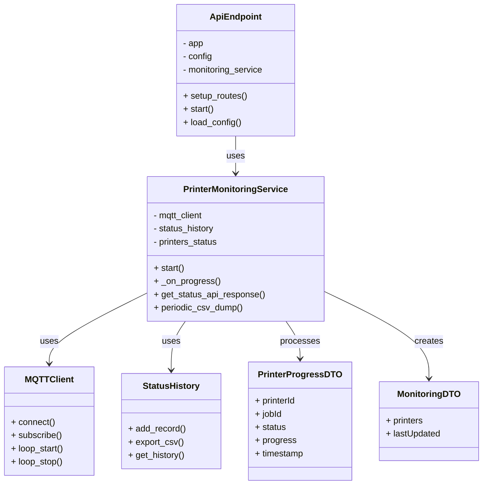

# Printer Monitoring Service

## Table of Contents

1. [Architecture Position](#architecture-position)
2. [Communication Protocols](#communication-protocols)
    - [MQTT Subscriptions](#mqtt-subscriptions)
    - [HTTP API Endpoints](#http-api-endpoints)
3. [Monitoring Features](#monitoring-features)
4. [Journey](#journey)
5. [Service Class Structure](#service-class-structure)
6. [Class Diagram](#class-diagram)
7. [Folder Structure](#folder-structure)
8. [Local](#local)
    - [Local Run](#local-run)
    - [Local Test](#local-test)
9. [Docker](#docker)
10. [Docker Compose](#docker-compose)

## Architecture Position

The Printer Monitoring service operates as a hybrid MQTT/HTTP microservice that:

- Subscribes to real-time progress data from 3D printers and robots
- Aggregates and stores printer status information
- Serves consolidated monitoring data via REST API endpoints
- Maintains historical status records for audit and analysis

```text
┌─────────────────┐    MQTT Topics      ┌─────────────────┐
│  3D Printers    │ ──────────────────► │   Printer       │
│                 │ device/printer/     │   Monitoring    │
│                 │ {id}/progress       │                 │
└─────────────────┘                     │                 │
                                        │                 │
┌─────────────────┐    MQTT Topics      │                 │
│  Robot System   │ ──────────────────► │                 │
│                 │ device/robot/       │                 │
│                 │ {id}/progress       │                 │
└─────────────────┘                     └─────────────────┘
                                                │ HTTP API
                                                │ GET /printer/status
                                                │
                                                ▼
┌─────────────────┐    HTTP Requests    ┌─────────────────┐
│   Web UI /      │ ◄─────────────────  │   API Gateway   │
│   API Gateway   │                     │                 │
└─────────────────┘                     └─────────────────┘
```

## Communication Protocols

### MQTT Subscriptions

#### Printer Progress Data Input

- **Topic**: `device/printer/{printerId}/progress`
- **Type**: 2.2.2) PrinterProgress
- **Purpose**: Monitor individual printer job progress and status
- **QoS**: 0 (fire and forget)

#### Robot Progress Data Input

- **Topic**: `device/robot/{robotId}/progress`
- **Type**: 2.3.2) RobotProgress
- **Purpose**: Monitor robot operations and coordination status
- **QoS**: 0 (fire and forget)

### HTTP API Endpoints

#### Printer Status Monitoring

- **Endpoint**: `GET /printer/status`
- **Type**: 1.3.1) PrinterStatus[]
- **Purpose**: Provide consolidated real-time printer monitoring data
- **Response Format**: JSON array of printer status objects

Types defined in [communication.md](../communication.md):

## Monitoring Features

### Real-time Status Aggregation

- **Printer Status Tracking**: Monitors current job progress, printer status, and last update timestamps
- **Multi-printer Support**: Handles multiple concurrent printer operations
- **Status Consolidation**: Aggregates printer progress data with job assignment information
- **Robot Coordination**: Tracks robot operations related to printer management

### Data Persistence

- **Status History**: Maintains historical records of all printer status updates
- **CSV Export**: Periodic export of status history for analysis and reporting
- **In-memory Storage**: Fast access to current printer states

### Job Assignment Integration

- **Job Tracking**: Associates printer progress with specific job assignments
- **Model Information**: Links printer status to print job details (model URL, parameters)
- **Progress Monitoring**: Real-time tracking of print job completion percentages

## Journey

The Printer Monitoring Service follows a continuous data aggregation and serving workflow:

### 1. Initialization Phase

- Load web and MQTT configuration files
- Initialize MQTT client and connect to broker
- Subscribe to printer and robot progress topics
- Initialize status history storage
- Set up HTTP API endpoints using Flask
- Start periodic CSV dump process

### 2. Data Collection Phase

- **Printer Progress Monitoring**: Continuously receive progress updates from active printers
- **Robot Status Monitoring**: Track robot operations and coordination activities
- **Data Validation**: Validate incoming progress data for completeness and accuracy
- **Status Aggregation**: Combine progress data with job assignment information

### 3. Data Processing Phase

- **Status Updates**: Update in-memory printer status records
- **Historical Logging**: Store status updates with timestamps for audit trail
- **Data Consolidation**: Merge printer progress with job metadata
- **Status Calculation**: Determine overall printer farm status and utilization

### 4. API Service Phase

- **Request Handling**: Process HTTP GET requests for printer status
- **Data Serialization**: Convert internal status objects to API response format
- **Real-time Response**: Provide up-to-date printer monitoring information
- **Cross-Origin Support**: Handle CORS for web UI integration

### 5. Persistence Management

- **Periodic Export**: Regular CSV dumps of status history
- **Data Cleanup**: Manage storage of completed job records
- **Historical Analysis**: Maintain data for performance analysis and reporting

## Service Class Structure

### Separation of Concerns

The printer monitoring service is organized into several key classes:

- **PrinterMonitoringService**  
  Main service class. Handles:
  - MQTT client initialization and subscription management
  - Processing incoming printer and robot progress messages
  - Maintaining in-memory status storage and historical records
  - Printer discovery and status aggregation
  - Periodic CSV export for data persistence
  - Service lifecycle management (start, stop, connect, disconnect)

- **ApiEndpoint**  
  Manages HTTP API functionality:
  - Flask application setup and configuration
  - REST endpoint definitions and routing
  - Request processing and response formatting
  - CORS handling for web UI integration
  - Configuration loading and management

- **MQTTClient**  
  Handles MQTT communications:
  - Broker connection management
  - Topic subscription and message handling
  - Message validation and parsing
  - Connection lifecycle management

- **StatusHistory**  
  Manages data persistence:
  - Historical status record storage
  - CSV export functionality
  - Data retention and cleanup

## Class Diagram



## Folder Structure

```text
printer_monitoring/
├── app/
│   ├── dto/                           # Data Transfer Objects
│   │   ├── printer_progress_dto.py    # Printer progress message schema
│   │   └── monitoring_dto.py          # API response schema
│   │
│   ├── http/                          # HTTP API components
│   │   ├── __init__.py
│   │   └── api_endpoint.py            # Flask API endpoint definitions
│   │
│   ├── models/                        # Core business logic
│   │   ├── __init__.py
│   │   └── printer_monitoring_service.py  # Main monitoring service
│   │
│   ├── mqtt/                          # MQTT client components
│   │   ├── __init__.py
│   │   ├── client.py                  # MQTT client wrapper
│   │   └── subscriber.py              # MQTT message subscription
│   │
│   ├── persistence/                   # Data persistence layer
│   │   ├── __init__.py
│   │   ├── status_history.py          # Status history management
│   │   └── save/                      # Persistent storage
│   │       └── status_history.csv     # Historical status data
│   │
│   ├── services/                      # Utility services
│   │   ├── __init__.py
│   │   └── discover_printers.py       # Network printer discovery
│   │
│   ├── main.py                        # Service entrypoint
│   ├── mqtt_config.yaml               # MQTT configuration for local run
│   └── web_config.yaml                # HTTP API configuration
│
├── config.yaml/                       # Additional configuration
├── target_mqtt_config.yaml            # MQTT configuration for Docker
├── target_web_conf.yaml               # Web configuration for Docker
│
├── requirements.txt
├── Dockerfile
└── README.md
```

- **app/**  
  Main application code.
  - **dto/**: Data Transfer Objects for MQTT messages and API responses.
  - **http/**: HTTP API implementation using Flask, including endpoint definitions and configuration.
  - **models/**: Core business logic, including the main `printer_monitoring_service.py`.
  - **mqtt/**: MQTT client implementation for receiving printer and robot progress updates.
  - **persistence/**: Data storage management, including status history and CSV export functionality.
  - **services/**: Utility services like printer discovery.
  - **main.py**: Service entrypoint and initialization.
  - **mqtt_config.yaml**: MQTT broker configuration for local development.
  - **web_config.yaml**: HTTP API server configuration.

- **target_mqtt_config.yaml** & **target_web_conf.yaml**  
  Docker-specific configurations for MQTT and HTTP services.

## Local

### Local Run

Move to the `printer_monitoring` directory:

```bash
cd IoT_Project/printer_monitoring
```

Install dependencies:

```bash
pip install -r requirements.txt
```

Run the service locally:

```bash
python3 -m app.main
```

The service will start both MQTT subscription and HTTP API server. The API will be available at the configured port (default: 8080).

### Local Test

To test the HTTP API endpoint:

```bash
curl http://localhost:8080/printer/status
```

To test MQTT integration, ensure the MQTT broker is running and printers are publishing progress data to the monitored topics.

You can also test with example data by publishing to the MQTT topics:

```bash
# Example: Publish printer progress
mosquitto_pub -h localhost -t "device/printer/printer-1/progress" \
  -m '{"printerId": "printer-1", "jobId": "job-123", "status": "printing", "progress": 42, "timestamp": "1642234567"}'
```

## Docker

Build the Docker image:

```bash
docker build -t printer_monitoring-image .
```

Run the container:

```bash
docker run --name printer_monitoring-container \
    -p 8080:8080 \
    -v ${PWD}/target_mqtt_config.yaml:/app/mqtt_config.yaml \
    -v ${PWD}/target_web_conf.yaml:/app/web_config.yaml \
    -v ${PWD}/app/persistence/save:/app/persistence/save \
    --network composed-mqtt-project_iot_network \
    --restart always \
    printer_monitoring-image
```

- `-d`: Runs the container in detached mode (omitted for debugging purposes).
- `--name printer_monitoring-container`: Names the container for easy reference.
- `-p 8080:8080`: Maps the container's port 8080 to the host for HTTP API access.
- `-v ...`: Mounts configuration files and persistence directory for status history.
- `--network composed-mqtt-project_iot_network`: Connects to the project's Docker network for MQTT communication.
- `--restart always`: Ensures automatic restart if the container stops.
- `printer_monitoring-image`: The Docker image to use.

The HTTP API will be available at [http://localhost:8080](http://localhost:8080).

To stop and remove the container:

```bash
docker stop printer_monitoring-container
docker rm printer_monitoring-container
```

To view logs:

```bash
docker logs printer_monitoring-container
```

To enter the container for debugging:

```bash
docker exec -it printer_monitoring-container /bin/bash
```

## Docker Compose

Follow the main readme instructions in the root directory of the project. ([main readme](../README.md))

The printer monitoring service integrates with the complete IoT system through the Docker Compose configuration, automatically connecting to the MQTT broker and exposing the HTTP API through
