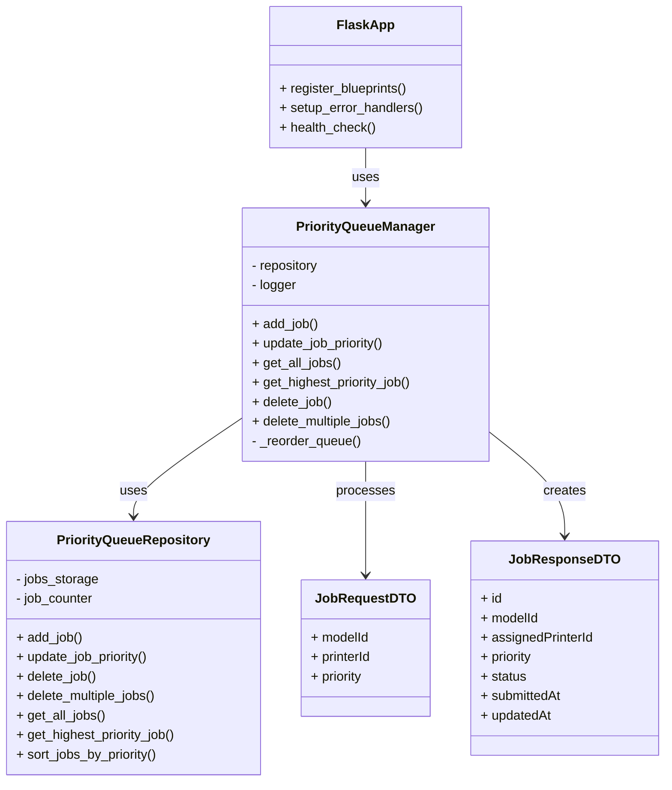

# Priority Queue Manager Service

## Table of Contents

1. [Architecture Position](#architecture-position)
2. [Communication Protocols](#communication-protocols)
    - [HTTP API Endpoints](#http-api-endpoints)
3. [Queue Management Features](#queue-management-features)
4. [Journey](#journey)
5. [Service Class Structure](#service-class-structure)
6. [Class Diagram](#class-diagram)
7. [Folder Structure](#folder-structure)
8. [Local](#local)
    - [Local Run](#local-run)
    - [Local Test](#local-test)
9. [Docker](#docker)
10. [Docker Compose](#docker-compose)

## Architecture Position

The Priority Queue Manager service operates as an HTTP-based microservice that:

- Manages print job queues with dynamic priority assignment
- Provides CRUD operations for job management via REST API
- Serves as the central job scheduling authority for the 3D printer farm
- Integrates with Web UI for user job management and Job Handler for automated job processing

```text
                                        ┌─────────────────┐
                                        │   Priority      │
┌─────────────────┐    HTTP API         │   Queue         │
│  API Gateway    │ ◄─────────────────► │   Manager       │
│                 │ /jobs routing       │                 │
└─────────────────┘                     │                 │
                                        │                 │
                                        │                 │
                                        │                 │
                                        └─────────────────┘
                                                │ HTTP API
                                                │ GET /prioritary_job
                                                │ GET /jobs
                                                ▼
                                        ┌─────────────────┐
                                        │  Job Handler    │
                                        │                 │
                                        └─────────────────┘
```

## Communication Protocols

### HTTP API Endpoints

#### Job Creation

- **Endpoint**: `POST /jobs`
- **Type**: 1.1.2) JobRequest → JobResponse
- **Purpose**: Create new print jobs with optional priority and printer assignment
- **Request Body**: JobRequestDTO
- **Response**: Created job details wrapped in JobResponseDTO

#### Job Retrieval

- **Endpoint**: `GET /jobs`
- **Type**: 1.1.1) JobResponse[]
- **Purpose**: Retrieve all jobs sorted by priority (highest first)
- **Response**: Array of job objects sorted by priority

#### Priority Job Consumption

- **Endpoint**: `GET /prioritary_job`
- **Type**: JobResponse (Consumer pattern)
- **Purpose**: Retrieve and remove the highest priority job from queue
- **Response**: Single highest priority job (job is removed from queue)

#### Job Priority Update

- **Endpoint**: `PUT /jobs/{jobId}`
- **Type**: 1.1.3) PriorityUpdate → JobResponse
- **Purpose**: Update job priority and automatically reorder queue
- **Request Body**: New priority value
- **Response**: Updated job details

#### Job Deletion

- **Endpoint**: `DELETE /jobs/{jobId}`
- **Type**: 1.1.4) Deletion confirmation
- **Purpose**: Remove single job from queue
- **Response**: HTTP 204 No Content

#### Bulk Job Deletion

- **Endpoint**: `DELETE /jobs?ids=job-1,job-2,...`
- **Type**: Bulk deletion confirmation
- **Purpose**: Remove multiple jobs in single request
- **Response**: HTTP 204 No Content

Types defined in [communication.md](../communication.md).

## Queue Management Features

### Dynamic Priority Management

- **Priority-based Sorting**: Jobs automatically sorted by priority (highest first)
- **Real-time Reordering**: Queue automatically reorders when priorities change
- **Configurable Priorities**: Support for integer priority values (higher = more urgent)
- **Default Priority**: New jobs default to priority 0 if not specified

### Consumer Pattern Implementation

- **Job Consumption**: `GET /prioritary_job` removes job from queue (consumer pattern)
- **Queue Management**: Automatic promotion of next highest priority job
- **Job Handler Integration**: Seamless integration with automated job processing

### Job Lifecycle Management

- **Status Tracking**: Track job status through pending, queued, in_progress, completed, failed states
- **Timestamp Management**: Automatic tracking of submission and update timestamps
- **Printer Assignment**: Optional printer assignment during job creation or later update

### Data Persistence

- **In-memory Storage**: Fast access to current job queue
- **Repository Pattern**: Clean separation between service logic and data access
- **Data Consistency**: Automatic queue reordering after modifications

## Journey

The Priority Queue Manager Service follows a job-centric workflow management pattern:

### 1. Initialization Phase

- Load configuration files (queue config and service config)
- Initialize Flask application with API routes
- Set up logging system with configurable levels
- Initialize PriorityQueueManager service and repository
- Register API blueprint with all CRUD endpoints
- Configure error handlers and health check endpoints

### 2. Job Creation Phase

- **Job Submission**: Receive job creation requests from Web UI via API Gateway
- **Data Validation**: Validate incoming job request data (modelId, optional printer, priority)
- **Job Assignment**: Generate unique job ID and set default values
- **Queue Insertion**: Add job to priority queue with automatic ordering
- **Response Generation**: Return created job details to requestor

### 3. Job Management Phase

- **Priority Updates**: Process priority change requests and reorder queue
- **Job Retrieval**: Serve complete job list requests sorted by priority
- **Job Deletion**: Handle single and bulk job deletion operations
- **Queue Maintenance**: Automatic queue reordering after any modifications

### 4. Job Distribution Phase

- **High Priority Retrieval**: Serve `GET /prioritary_job` requests from Job Handler
- **Consumer Pattern**: Remove highest priority job from queue upon retrieval
- **Queue Advancement**: Automatically promote next highest priority job
- **Job Handler Integration**: Enable automated job processing workflow

### 5. Status Monitoring Phase

- **Health Checks**: Provide service health status via `/health` endpoint
- **Error Handling**: Comprehensive error handling with appropriate HTTP status codes
- **Logging**: Detailed logging of all operations for debugging and monitoring
- **Performance Tracking**: Monitor queue operations and API response times

## Service Class Structure

### Separation of Concerns

The priority queue manager service is organized into several key classes:

- **PriorityQueueManager**  
  Main service class. Handles:
  - Job creation with automatic ID generation and queue insertion
  - Priority updates with automatic queue reordering
  - Job retrieval (all jobs and highest priority job)
  - Job deletion (single and bulk operations)
  - Queue management and ordering logic
  - Integration with repository layer for data persistence

- **PriorityQueueRepository**  
  Data access layer:
  - In-memory storage of job queue
  - CRUD operations for job data
  - Queue sorting and ordering algorithms
  - Data consistency management

- **Flask API Routes**  
  HTTP endpoint management:
  - RESTful API endpoint definitions
  - Request validation and response formatting
  - Error handling and status code management
  - CORS support for web UI integration

- **Configuration Management**  
  Service configuration:
  - YAML-based configuration loading
  - Environment-specific settings
  - Logging configuration and setup

## Class Diagram



## Folder Structure

```text
priority_queue_manager/
├── app/
│   ├── api/                           # HTTP API layer
│   │   ├── __init__.py
│   │   └── routes.py                  # Flask API endpoint definitions
│   │
│   ├── config/                        # Configuration management
│   │   ├── config.yaml                # Service configuration
│   │   └── priority_queue_config.yaml # Queue-specific settings
│   │
│   ├── dto/                           # Data Transfer Objects
│   │   ├── __init__.py
│   │   ├── job_request_dto.py         # Job creation request schema
│   │   ├── job_response_dto.py        # Job response schema
│   │   └── priority_update_dto.py     # Priority update request schema
│   │
│   ├── model/                         # Core business logic
│   │   ├── __init__.py
│   │   └── priority_queue_service.py  # Main queue management service
│   │
│   ├── persistence/                   # Data access layer
│   │   ├── __init__.py
│   │   └── repository.py              # Job storage and retrieval
│   │
│   └── main.py                        # Service entrypoint and Flask app setup
│
├── config.yaml/                       # Additional configuration
├── data/                              # Data storage directory
│
├── test/                              # Testing components
│   └── priority_tester.py             # Service integration tests
│
├── howtodo.md                         # Implementation guidance
├── requirements.txt
├── Dockerfile
└── README.md
```

- **app/**  
  Main application code.
  - **api/**: Flask API implementation with all REST endpoints and error handling.
  - **config/**: Configuration management including service and queue-specific settings.
  - **dto/**: Data Transfer Objects for request/response schemas and validation.
  - **model/**: Core business logic including the main `priority_queue_service.py` with queue management algorithms.
  - **persistence/**: Data access layer with repository pattern implementation for job storage.
  - **main.py**: Service entrypoint, Flask app initialization, and configuration loading.

- **test/**  
  Testing components including integration tests for queue operations.

- **howtodo.md**  
  Implementation guidance and technical specifications.

## Local

### Local Run

Move to the `priority_queue_manager` directory:

```bash
cd IoT_Project/priority_queue_manager
```

Install dependencies:

```bash
pip install -r requirements.txt
```

Run the service locally:

```bash
python3 -m app.main
```

The service will start the Flask application and be available at the configured port (default: 8080).

### Local Test

To test the HTTP API endpoints:

#### Create a new job:
```bash
curl -X POST http://localhost:8080/jobs \
  -H "Content-Type: application/json" \
  -d '{"modelId": "model-123", "priority": 5}'
```

#### Get all jobs:
```bash
curl http://localhost:8080/jobs
```

#### Update job priority:
```bash
curl -X PUT http://localhost:8080/jobs/job-123 \
  -H "Content-Type: application/json" \
  -d '{"priority": 10}'
```

#### Get highest priority job (consumer pattern):
```bash
curl http://localhost:8080/prioritary_job
```

#### Delete a job:
```bash
curl -X DELETE http://localhost:8080/jobs/job-123
```

#### Health check:
```bash
curl http://localhost:8080/health
```

You can also run the integration test:

```bash
cd IoT_Project/priority_queue_manager/test
python3 priority_tester.py
```

## Docker

Build the Docker image:

```bash
docker build -t priority_queue_manager-image .
```

Run the container:

```bash
docker run --name priority_queue_manager-container \
    -p 8080:8080 \
    -v ${PWD}/app/config:/app/config \
    -v ${PWD}/data:/app/data \
    --network composed-mqtt-project_iot_network \
    --restart always \
    priority_queue_manager-image
```

- `-d`: Runs the container in detached mode (omitted for debugging purposes).
- `--name priority_queue_manager-container`: Names the container for easy reference.
- `-p 8080:8080`: Maps the container's port 8080 to the host for HTTP API access.
- `-v ...`: Mounts configuration and data directories for persistence.
- `--network composed-mqtt-project_iot_network`: Connects to the project's Docker network.
- `--restart always`: Ensures automatic restart if the container stops.
- `priority_queue_manager-image`: The Docker image to use.

The HTTP API will be available at [http://localhost:8080](http://localhost:8080).

To stop and remove the container:

```bash
docker stop priority_queue_manager-container
docker rm priority_queue_manager-container
```

To view logs:

```bash
docker logs priority_queue_manager-container
```

To enter the container for debugging:

```bash
docker exec -it priority_queue_manager-container /bin/bash
```

## Docker Compose

Follow the main readme instructions in the root directory of the project. ([main readme](../README.md))

The priority queue manager service integrates with the complete IoT system through the Docker Compose configuration, automatically connecting to the API Gateway for web UI integration and providing job management services to the

