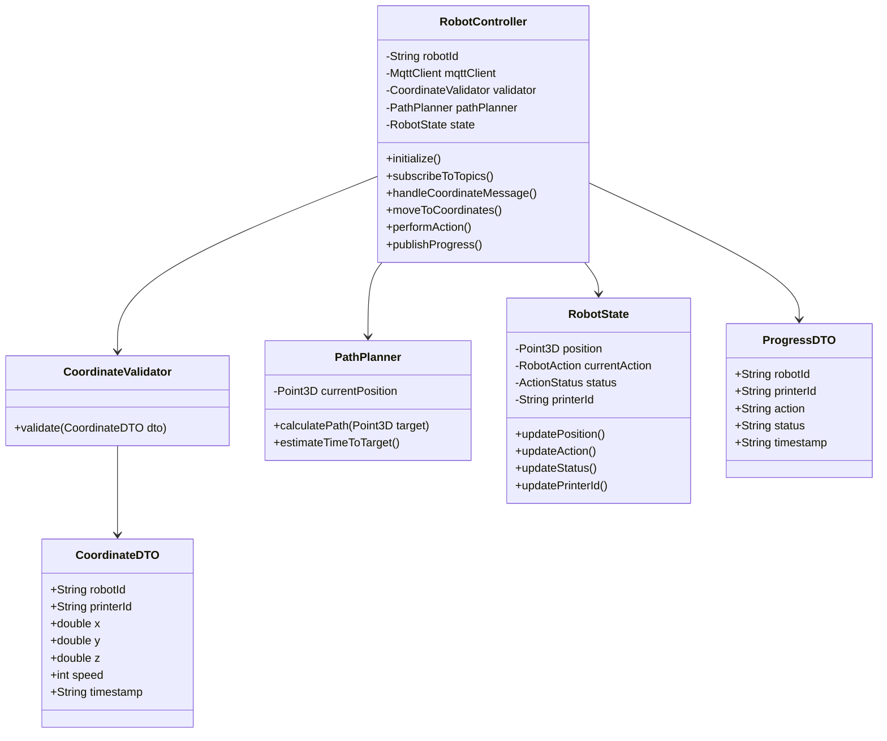

# 🤖 Robot Device Microservice

## Table of Contents
- [Overview](#overview)
- [Features](#features)
- [Architecture](#architecture)
- [Folder Structure](#folder-structure)
- [Communication Protocol](#communication-protocol)
  - [MQTT Topics](#mqtt-topics)
  - [Message Structure](#message-structure)
- [Operation Workflow](#operation-workflow)
- [Configuration](#configuration)
- [Deployment](#deployment)
- [Development](#development)
- [Troubleshooting](#troubleshooting)

## Overview

This microservice implements a Cartesian robot device that handles the physical task of unloading completed prints from 3D printers in the laboratory. The robot can navigate to specific coordinates, pick up printed objects, transport them to a designated unloading area, and return to its home position.

While the current implementation includes only one robot instance, the modular architecture supports multiple robots by initializing them with distinct IDs in the Docker Compose configuration.

## Features

- **Coordinate-based Navigation**: Moves to specific X, Y, Z coordinates using path planning
- **Automated Actions**: Performs pick, place, and return operations
- **Real-time Status Updates**: Publishes progress and status information
- **Error Handling**: Detects and reports operation failures
- **Configurable Parameters**: Customizable home position, speed, and unloading area
- **Scalable Design**: Supports multiple robot instances

## Architecture

The robot microservice follows a modular architecture with the following components:



## Folder Structure

```
robot/
├── app/                      # Main application code
│   ├── __init__.py
│   ├── controller/           # Robot controller logic
│   │   ├── __init__.py
│   │   └── robot_controller.py
│   ├── dto/                  # Data Transfer Objects
│   │   ├── __init__.py
│   │   ├── coordinate_dto.py
│   │   └── progress_dto.py
│   ├── service/              # Business logic
│   │   ├── __init__.py
│   │   ├── path_planner.py
│   │   └── mqtt_service.py
│   ├── utils/                # Utility functions
│   │   ├── __init__.py
│   │   └── validators.py
│   └── robot_service.py      # Main entry point
├── config/                   # Configuration files
│   └── robot_config.yaml
├── logs/                     # Log files directory
├── tests/                    # Unit and integration tests
│   ├── __init__.py
│   ├── test_controller.py
│   ├── test_path_planner.py
│   └── test_validators.py
├── Dockerfile                # Docker configuration
├── requirements.txt          # Python dependencies
├── README.md                 # Documentation
└── run.py                    # Script to run the application
```

### Key Components

- **controller/robot_controller.py**: Core logic for robot operations and state management
- **dto/coordinate_dto.py**: Data model for coordinate messages received from Robot Management
- **dto/progress_dto.py**: Data model for progress messages sent to Job Handler and Printer Monitoring
- **service/path_planner.py**: Path calculation and motion planning algorithms
- **service/mqtt_service.py**: MQTT communication handling and message processing
- **utils/validators.py**: Input validation and data sanitization
- **robot_service.py**: Application entry point and service initialization
- **config/robot_config.yaml**: Configuration parameters for the robot and MQTT connection

## Communication Protocol

The robot device communicates exclusively using the MQTT protocol, providing a lightweight and reliable publish/subscribe messaging system.

### MQTT Topics

#### Subscribed Topics
The robot subscribes to:
```
device/robot/{robotId}/coordinates
```

#### Published Topics
The robot publishes to:
```
device/robot/{robotId}/progress
```

**Note**: The robot only publishes a progress message when it has completed its entire operation cycle and returned to the home position, ready for a new assignment.

### Message Structure

All messages use JSON format for data interchange.

#### Coordinate Command (Incoming)

```json
{
  "robotId": "rob-1",
  "printerId": "printer-1",
  "x": 120,
  "y": 45,
  "z": 10,
  "speed": 200,
  "timestamp": "2025-06-15T08:32:05Z"
}
```

| Field | Type | Description | Required |
|-------|------|-------------|----------|
| `robotId` | String | Unique identifier for the robot | Yes |
| `printerId` | String | Identifier of the printer to service | Yes |
| `x` | Number | X-coordinate in millimeters | Yes |
| `y` | Number | Y-coordinate in millimeters | Yes |
| `z` | Number | Z-coordinate in millimeters | Yes |
| `speed` | Number | Movement speed in mm/s | No |
| `timestamp` | String | ISO 8601 formatted timestamp | Yes |

#### Progress Update (Outgoing)

The robot publishes a single progress message when it has completed the entire operation cycle (pick, transport, place, return) and is ready for a new assignment:

```json
{
  "robotId": "rob-1",
  "printerId": "printer-1",
  "action": "idle",
  "status": "completed",
  "timestamp": "2025-06-15T08:35:45Z"
}
```

| Field | Type | Description | Possible Values |
|-------|------|-------------|----------------|
| `robotId` | String | Unique identifier for the robot | Any valid robot ID |
| `printerId` | String | Identifier of the printer that was serviced | Any valid printer ID |
| `action` | String | Current action state | `idle` (ready for new assignment) |
| `status` | String | Status of the operation cycle | `completed` (successfully finished entire cycle) |
| `timestamp` | String | ISO 8601 formatted timestamp | Current time |

## Operation Workflow

The robot follows a defined sequence of operations, publishing a status update only upon completion of the entire cycle:

1. **Initialization**:
   - Load configuration parameters
   - Connect to MQTT broker
   - Subscribe to coordinate topic
   - Set initial state to idle

2. **Coordinate Reception**:
   - Receive coordinate message
   - Validate message format and values
   - Parse target coordinates, printer ID, and optional parameters
   - Store printer ID for use in the completion message

3. **Navigation**:
   - Calculate path to target coordinates
   - Begin movement
   - Arrive at 3D printer location

4. **Pick Operation**:
   - Execute pick operation sequence
   - Retrieve printed object

5. **Transport**:
   - Calculate path to unloading area
   - Navigate to unloading area

6. **Place Operation**:
   - Execute place operation sequence
   - Deposit printed object

7. **Return to Home**:
   - Calculate path to home position
   - Navigate to home position
   - Publish "idle" action with "completed" status and printer ID
   - Ready for next task

## Configuration

The robot can be configured using environment variables and a configuration file:

### Environment Variables

| Variable | Description | Default |
|----------|-------------|---------|
| `ROBOT_ID` | Unique identifier for the robot | `rob-1` |
| `MQTT_BROKER_HOST` | Hostname of the MQTT broker | `broker` |
| `MQTT_BROKER_PORT` | Port of the MQTT broker | `1883` |
| `HOME_X` | X-coordinate of home position | `0` |
| `HOME_Y` | Y-coordinate of home position | `0` |
| `HOME_Z` | Z-coordinate of home position | `0` |

### Configuration File

```yaml
robot:
  id: "rob-1"
  default_speed: 150
  max_speed: 300
  acceleration: 50
  home_position:
    x: 0
    y: 0
    z: 0
  unloading_area:
    x: 500
    y: 500
    z: 50
mqtt:
  broker_host: "broker"
  broker_port: 1883
  qos: 0
  client_id: "robot-client"
```

## Deployment

### Docker Container

```yaml
robot:
  build:
    context: ./robot
  container_name: robot-container
  restart: always
  volumes:
    - ./robot/config:/app/config
  environment:
    - ROBOT_ID=rob-1
  networks:
    - iot_network
```

### Running Locally

```bash
# Install dependencies
pip install -r requirements.txt

# Run the robot service
python robot_service.py
```

## Development

### Required Dependencies

- Python 3.9+
- Paho MQTT Client
- PyYAML
- Dataclasses

### Testing

```bash
# Run unit tests
pytest tests/

# Run integration tests
pytest integration_tests/
```

## Troubleshooting

### Common Issues

1. **Connection Issues**:
   - Verify MQTT broker is running
   - Check network connectivity
   - Confirm correct broker hostname and port

2. **Message Not Received**:
   - Verify topic subscription
   - Check message format (valid JSON)
   - Ensure correct robotId and printerId in messages

3. **No Completion Message**:
   - Verify the robot has successfully completed its entire operation cycle
   - Check if the robot encountered any obstacles or errors
   - Verify network connectivity during operation completion

4. **Unexpected Behavior**:
   - Check logs for validation errors
   - Verify configuration parameters
   - Restart the robot service

For more assistance, please refer to the main project documentation or contact the development team.