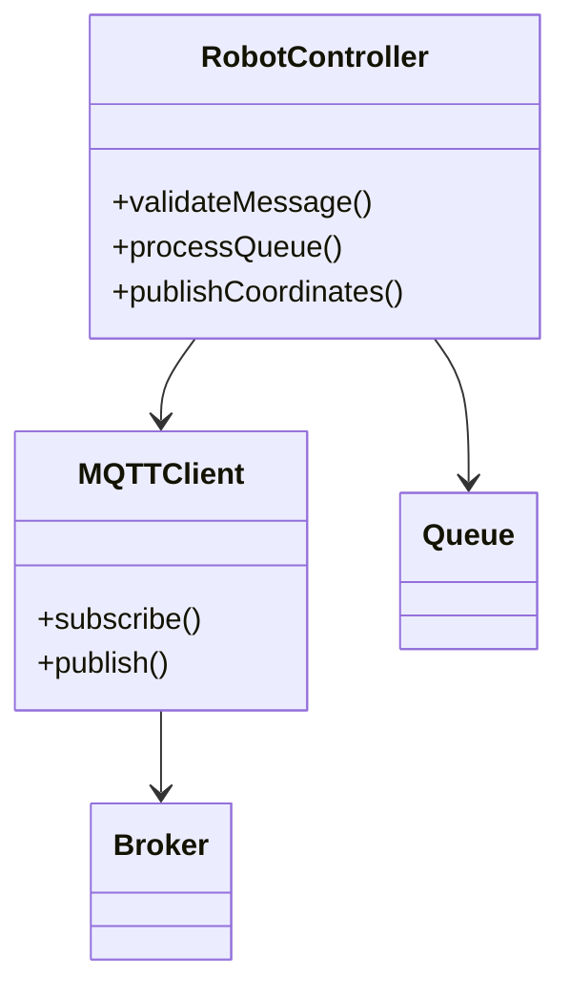

# Robot Management Microservice

## Overview
This microservice is responsible for managing robot device operations within an IoT manufacturing environment. It coordinates robot movements to service 3D printers by assigning missions based on printer status updates. Currently designed for one robot, the architecture supports multiple robots for future scalability.

**Port:** 8120 (configurable)

## Class Structure


## Folder Structure
The folder structure is as follows:

```
robot_management/ 
├── app/ 
│   ├── __init__.py 
│   ├── main.py # Entry point 
│   ├── mqtt/ # MQTT folder containing logic 
│   ├── controller.py # RobotController class 
│   ├── dto/ 
│   │   └── python dto files for messages
│   ├── config.py # if necessary 
│   ├── config.yaml
├── Dockerfile 
├── requirements.txt 
└── README.md
```

## Communications

This microservice communicates via the MQTT protocol.

### Topics

Robot management subscribes to the following topics:
    
    device/printers
    device/robot/robot{id}/progress
    

Robot management publishes to the following topic:

    device/robot/robot{id}/coordinates

### Broker

The MQTT Mosquitto broker is available at port 1883.

### Topic Messages

Messages over the `device/printers` topic have the following JSON structure:

```json
{
  "printers": [
    { "printerId": "printer-1", "status": "work", "timestamp": "2025-07-09T10:00:00Z" },
    { "printerId": "printer-2", "status": "finish", "timestamp": "2025-07-09T10:00:00Z" },
    { "printerId": "printer-3", "status": "work", "timestamp": "2025-07-09T10:00:00Z" }
  ]
}
```

- `status` can be `"work"` or `"finish"`.

Messages over the `device/robot/robot{id}/coordinates` topic have the following JSON structure:

```json
{ 
  "robotId": "rob-1",
  "printerId": "printer-1", 
  "x": 120, 
  "y": 45, 
  "z": 10, 
  "speed": 200, 
  "timestamp": "2025-06-15T08:32:05Z" 
}
```

- `speed` is optional, and coordinates are expressed in millimeters.

Messages over the `device/robot/robot{id}/progress` topic have the following JSON structure:

```json
{ 
  "robotId": "rob-1", 
  "printerId": "printer-1", 
  "action": "pick", 
  "status": "in_progress", 
  "timestamp": "2025-06-15T08:32:10Z" 
}
```

- `action` can be `"pick"`, `"place"`, or `"idle"`.
- `status` can be `"in_progress"`, `"completed"`, or `"error"`.
- An optional `jobId` parameter (string) may also be included.

## Internal Logic

1. Subscribes to the `device/printers` topic.
2. Validates incoming messages using a DTO, ensuring they follow the expected JSON structure.
3. Maintains an internal queue (`robot_queue`) where validated messages are appended in chronological order.
   - The first element in the queue is the oldest message.
4. Checks the `robot_queue`:
   - If empty, does nothing.
   - If not empty, processes the first element:
     - If `status` is `"finish"`, extracts the `printerId` value.
     - Retrieves the coordinates of the printer with the given `printerId` from the configuration file.
     - Publishes the coordinates (without `speed`) to the `device/robot/{robotId}/coordinates` topic, including the `printerId`.
     - Waits for a message on the `device/robot/robot{id}/progress` topic.
       - Validates the message using a DTO.
       - If `status` is `"completed"`, the robot has finished the procedure.
5. Repeats the process.

## Error Handling

- Invalid messages are discarded with appropriate logging.
- Connection issues with the MQTT broker are retried with exponential backoff.
- Configuration file errors are logged, and the service halts until resolved.

## Testing

- Unit tests are provided for message validation, queue processing, and MQTT communication.
- Integration tests simulate end-to-end workflows with mock MQTT brokers.

## Deployment

This microservice is containerized using Docker. It can be deployed as part of a larger system using Docker Compose.

```bash
docker build -t robot-management .
docker run -p 8120:8120 robot-management
```