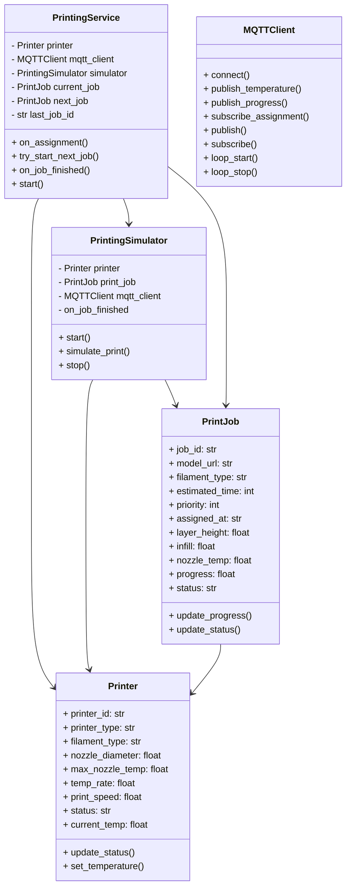

# ST Printer Service

## Table of Contents

1. [Architecture Position](#architecture-position)
2. [Communication Protocols](#communication-protocols)
    - [MQTT Subscriptions](#mqtt-subscriptions)
    - [MQTT Publications](#mqtt-publications)
3. [Printer Features](#printer-features)
    - [Print Job Management](#print-job-management)
    - [Temperature Simulation](#temperature-simulation)
    - [Printer Configuration and Operating Parameters](#printer-configuration-and-operating-parameters)
4. [Journey](#journey)
    - [Initialization Phase](#1-initialization-phase)
    - [Assignment Reception Phase](#2-assignment-reception-phase)
    - [Printing Simulation Phase](#3-printing-simulation-phase)
    - [Completion Phase](#4-completion-phase)
5. [Service Class Structure](#service-class-structure)
    - [Separation of Concerns](#separation-of-concerns)
    - [Class Diagram](#class-diagram)
6. [Folder Structure](#folder-structure)
7. [Local](#local)
    - [Local run Instructions](#local-run-instructions)
    - [Local Testing Instructions](#local-testing-instructions)
8. [Docker](#docker)
    - [Build the Docker Image](#1-build-the-docker-image)
    - [Run the Docker Container](#2-run-the-docker-container)
9. [Docker Compose](#docker-compose)

## Architecture Position

The ST Printer service operates as an MQTT-based microservice that simulates individual 3D printer behavior within the automated printing lab. Each printer instance:

- Receives print job assignments from the Job Handler
- Reports temperature readings for monitoring (global temperature) and safety (anomaly detection)
- Publishes print progress updates for coordination with the Job Handler and Printer Monitoring Service

```text
┌─────────────────┐    MQTT Topics      ┌─────────────────┐
│   Job Handler   │ ──────────────────► │                 │
│                 │ device/printer/     │                 │
│                 │ {id}/assignment     │                 │
│                 │                     │                 │
################### publish separation ###########################
│                 │                     │                 │
│                 │      MQTT Topics    │                 │
│                 │ ◄────────────────── │                 │
│                 │ device/printer/     │                 │
└─────────────────┘ {id}/progress       │                 |
                                        │                 │
                                        │   ST Printer    │
┌─────────────────┐    MQTT Topics      │                 │
│   Printer       │   device/printer/   │                 │
│   Monitoring    │    {id}/progress    │                 │
│   Service       │ ◄────────────────── │                 │
│                 │                     │                 │
└─────────────────┘                     │                 │
                                        │                 │
┌──────────────────┐    MQTT Topics     │                 │
│Global Temperature│ ◄───────────────── │                 │
│                  │ device/printer/    │                 │
└──────────────────┘ {id}/temperature   └─────────────────┘
                                                │
                                                │ MQTT Topics
                                                │ device/printer/{id}/temperature
                                                │
                                                ▼
                                        ┌──────────────────┐
                                        │                  │
                                        │Printer Monitoring│
                                        └──────────────────┘

```

## Communication Protocols

### MQTT Subscriptions

#### Print Job Assignment

- **Topic**: `device/printer/{printerId}/assignment`
- **Type**: 2.2.3) PrinterAssignment
- **Purpose**: Receive print job assignments with model files and specifications

### MQTT Publications

#### Temperature Monitoring

- **Topic**: `device/printer/{printerId}/temperature`
- **Type**: 2.1.2) TemperatureReadingPrinter
- **Purpose**: Report current nozzle temperature for safety monitoring

#### Print Progress Updates

- **Topic**: `device/printer/{printerId}/progress`
- **Type**: 2.2.2) PrinterProgress
- **Purpose**: Report current print status and completion percentage

See [communication.md](../communication.md) for

## Printer Features

### Print Job Management

- **Assignment Processing**: Receives and validates print job assignments
- possible improvement (**Job Validation**: Checks model file URLs, filament types, and estimated print times)
- **Next Job Handling**: Manages next job assignment logic to ensure sequential processing
  - accepts a new job only if the printer is idle or the next job is different from the current one (checking job ID)
  - store (the current job in progress and ) last job received from the Job Handler

- **Model File Handling**: Processes GCODE files from provided URLs (assumes local files)
- **Print Simulation**: Simulates realistic printing behavior with time progression
- **Status Tracking**: Maintains current job state and progress information
  - The printer publishes its status idle every 30 seconds when not printing

### Temperature Simulation

- **Realistic Temperature Curves**: Simulates heating up, printing, and cooling down phases given the nozzle in the PrinterAssignment. (assumes a cold bed temperature)
- **Thermal Behavior**: Simulates temperature fluctuations during printing
- **Safety Monitoring**: Often reports temperature anomalies for anomaly detection checks

### Printer Configuration and Operating Parameters

- printer type (e.g., Prusa MK3S, Creality Ender 3, Bambulab X1)
- filament type
- nozzle diameter
- max nozzle temperature, temp rate
- print speed (function based on filament type, nozzle diameter, layer height, infill)

## Journey

The ST Printer Service follows a complete print job lifecycle:

### 1. Initialization Phase

- Load printer configuration and operating parameters
- Initialize MQTT client and connect to broker
- Subscribe to assignment topic for the specific printer ID
- Initialize temperature sensor simulation
- Set printer status to "idle"

### 2. Assignment Reception Phase

- **Job Assignment**: Receive print job assignment from Job Handler
- **Validation**: Validate job parameters (model URL, filament type, estimated time)
  - **Callback Assignment**: The printer has a callback function that processes the change in assignment, updating its internal job state (checking if the assignment is not already in progress or completed)
- **Model Download**: Fetch GCODE file from provided URL
- **Preparation**: Initialize print simulation parameters
- **Status Update**: Report "printing" status with 0% progress

### 3. Printing Simulation Phase

- **Temperature Ramp-Up**: Simulate nozzle heating to target temperature
- **Print Progress**: Incrementally update print progress over estimated time
- **Temperature Monitoring**: Continuously report realistic temperature readings
- **Progress Reporting**: Publish progress updates at regular intervals

### 4. Completion Phase

- **Print Completion**: Report 100% progress and "completed" status
- **Cool-Down**: Simulate nozzle cooling down to room temperature
- **Plate Ready**: Signal that printed object is ready for collection
- **Status Reset**: Return to "idle" status awaiting robot collection

## Service Class Structure

### Separation of Concerns

The architecture follows a clear separation where:

- PrintingService handles external interactions:
  - MQTT subscriptions and publications
  - Print job assignment processing
  - Status and progress reporting
  - Temperature data publication

- PrintingSimulator handles the core printing logic:
  - Print progress calculation
  - Temperature simulation
  - Time management
  - State transitions

- PrintJob encapsulates job-specific data:
  - Job parameters and metadata
  - Validation logic
  - Status tracking

### Class Diagram



## Folder Structure

```text
st_printer/
├── app/
│   ├── classes/                  
│   │   ├── printing_service.py       # Handles MQTT, job assignment, status reporting
│   │   └── printing_simulator.py     # Simulates print progress and temperature
│   │
│   ├── dto/                      # Data Transfer Objects for message schemas
│   │   ├── printer_assignment_dto.py
│   │   ├── printer_progress_dto.py
│   │   └── temperature_reading_printer_dto.py
│   │
│   ├── main.py                   # Main entry point for the service
│   │
│   ├── models/                   # Data models for printer, job, assignment
│   │   ├── printer.py
│   │   ├── print_job.py
│   │   └── printer_assignment.py
│   │
│   ├── mqtt/                     # MQTT client, publisher, subscriber logic
│   │   ├── client.py
│   │   ├── publisher.py
│   │   └── subscriber.py
│   │
│   ├── printer_config.yaml       # Printer hardware/configuration settings
│   └── printer_mqtt_config.yaml  # MQTT broker/topic configuration for local development
│
├── Dockerfile                    # Docker build instructions for service container
├── README.md                     # Service documentation and usage instructions
├── requirements.txt              # Python dependencies
│
├── target_printer_mqtt_config.yaml # Docker-specific MQTT config for docker containers
│
└── tests/
    ├── Dockerfile                # Dockerfile for test 
    └── st_printer_tester.py      # Test script for simulating assignments and monitoring output
```

**Explanation:**

- **app/**: Main application code, organized by functionality.
  - **classes/**: Implements core classes for service logic and simulation.
  - **dto/**: Defines message schemas for MQTT communication.
  - **models/**: Contains data models for printers and jobs.
  - **mqtt/**: MQTT client, publisher, and subscriber modules.
  - **main.py**: Service entry point.
  - **printer_config.yaml**: Printer hardware/configuration settings.
  - **printer_mqtt_config.yaml**: MQTT broker/topic configuration for local development.
- **Dockerfile**: Instructions for building the Docker container.
- **README.md**: Documentation for setup, usage, and architecture.
- **requirements.txt**: Python package requirements.
- **target_printer_mqtt_config.yaml**: Docker-specific MQTT configuration for docker containers.
- **tests/**: Scripts and Dockerfile for local and containerized testing.

## Local

### Local run Instructions

Move to the `st_printer` directory:

```bash
cd IoT_Project/st_printer
```

Install dependencies with:

```bash
pip install -r requirements.txt
```

Run the application with:

```bash
python3 -m app.main
```

### Local Testing Instructions

To test the application locally, ensure you have the required dependencies installed and follow these steps:

Open a new terminal:

```bash
cd IoT_Project/st_printer/tests
python3 st_printer_tester.py
```

This python script will populate the assignments topic with test data and print the st_printer pubblications on the console.

## Docker

### 1. Build the Docker Image

Navigate to the `st_printer` directory and build the image:

```bash
docker build -t st-printer-image .
```

### 2. Run the Docker Container

Start the container with the following command:

```bash
docker run --name st-printer-container \
  -p 8130:8130 \
  -v ${PWD}/target_printer_mqtt_config.yaml:/app/printer_mqtt_config.yaml \
  --network composed-mqtt-project_iot_network \
  --restart always \
  st-printer-image
```

- `--env PRINTER_ID=printer_001`: Sets the printer ID variable.
- `-p 8130:8130`: Maps port 8130 from the container to the host.
- `--network composed-mqtt-project_iot_network`: Connects the container to the specified Docker network for MQTT communication. Replace with your network name if different.
- `--restart always`: Ensures the container restarts automatically if it stops.

For more advanced setups, refer to the [Docker Compose](#docker-compose) section below.

### 3. Run the Tester Script in a Container

#### Build the Tester Docker Image

Move to the `tests` directory 

```bash
cd st_printer/tests
```

build the tester image:

```bash
docker build -t st-printer-tester-image .
```

#### Run the Tester Container

Start the tester container with:

```bash
docker run --name st-printer-tester-container \
  -p 8115:8115 \
  --network composed-mqtt-project_iot_network \
  --restart always \
  st-printer-tester-image
```

- `-p 8115:8115`: Maps port 8115 for communication with st printers. The tester publishes assignments replacing the Job Handler (8115 is the port used by the Job Handler) and listens to the printer progress and temperature publications.
- `--network composed-mqtt-project_iot_network`: Ensures the tester can communicate with other services over MQTT.
- `--restart always`: Automatically restarts the container if it stops.

This setup allows you to simulate job assignments and monitor printer service outputs within the Docker environment.

## Docker Compose

For St Printer with Docker Compose, follow the main readme instructions in the root directory of the project. ([main readme](../README.md))
