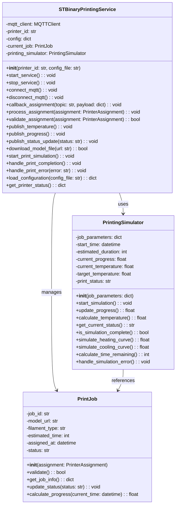

work in progress

# ST Printer Service

## Architecture Position

The ST Printer service operates as an MQTT-based microservice that simulates individual 3D printer behavior within the automated printing lab. Each printer instance:

- Receives print job assignments from the Job Handler
- Reports temperature readings for monitoring and safety
- Publishes print progress updates for coordination
- Communicates with the Robot Management system for plate handling

```text
┌─────────────────┐    MQTT Topics      ┌─────────────────┐
│   Job Handler   │ ──────────────────► │   ST Printer    │
│                 │ device/printer/     │                 │
│                 │ {id}/assignment     │                 │
│                 │                     │                 │
│                 │      MQTT Topics    │                 │
│                 │ ◄────────────────── │                 │
│                 │ device/printer/     │                 │
└─────────────────┘ {id}/progress       │                 │
                                        │                 │
┌──────────────────┐    MQTT Topics     │                 │
│Global Temperature│ ◄──────────────────│                 │
│                  │ device/printer/    │                 │
└──────────────────┘ {id}/temperature   └─────────────────┘
                                                │
                                                │ MQTT Topics
                                                │ device/printer/{id}/temperature
                                                │
                                                ▼
                                        ┌──────────────────┐
                                        │                  │
                                        │Printer Monitoring│
                                        └──────────────────┘
```

## Communication Protocols

### MQTT Subscriptions

#### Print Job Assignment

- **Topic**: `device/printer/{printerId}/assignment`
- **Type**: 2.2.1) PrinterAssignment
- **Purpose**: Receive print job assignments with model files and specifications

### MQTT Publications

#### Temperature Monitoring

- **Topic**: `device/printer/{printerId}/temperature`
- **Type**: 2.1.2) TemperatureReading
- **Purpose**: Report current nozzle temperature for safety monitoring

#### Print Progress Updates

- **Topic**: `device/printer/{printerId}/progress`
- **Type**: 2.2.2) PrinterProgress
- **Purpose**: Report current print status and completion percentage

Types defined in [communication.md](../communication.md)

## Printer Features

### Print Job Management

- **Assignment Processing**: Receives and validates print job assignments
- **Model File Handling**: Downloads and processes GCODE files from provided URLs
- **Print Simulation**: Simulates realistic printing behavior with time progression
- **Status Tracking**: Maintains current job state and progress information

### Temperature Simulation

- **Realistic Temperature Curves**: Simulates heating up, printing, and cooling down phases
- **Thermal Behavior**: Models realistic temperature fluctuations during printing
- **Safety Limits**: Respects configured temperature thresholds and operating ranges

### Error Handling

- **Job Validation**: Validates incoming print assignments
- **Error Recovery**: Handles network issues and malformed messages
- **Status Reporting**: Reports error conditions and recovery attempts

## Journey

The ST Printer Service follows a complete print job lifecycle:

### 1. Initialization Phase

- Load printer configuration and operating parameters
- Initialize MQTT client and connect to broker
- Subscribe to assignment topic for the specific printer ID
- Initialize temperature sensor simulation
- Set printer status to "idle"

### 2. Assignment Reception Phase

- **Job Assignment**: Receive print job assignment from Job Handler
- **Validation**: Validate job parameters (model URL, filament type, estimated time)
- **Model Download**: Fetch GCODE file from provided URL
- **Preparation**: Initialize print simulation parameters
- **Status Update**: Report "printing" status with 0% progress

### 3. Printing Simulation Phase

- **Temperature Ramp-Up**: Simulate nozzle heating to target temperature
- **Print Progress**: Incrementally update print progress over estimated time
- **Temperature Monitoring**: Continuously report realistic temperature readings
- **Progress Reporting**: Publish progress updates at regular intervals

### 4. Completion Phase

- **Print Completion**: Report 100% progress and "completed" status
- **Cool-Down**: Simulate nozzle cooling down to room temperature
- **Plate Ready**: Signal that printed object is ready for collection
- **Status Reset**: Return to "idle" status awaiting robot collection

### 5. Error Handling Phase

- **Error Detection**: Monitor for simulation errors or invalid states
- **Error Reporting**: Publish "error" status with diagnostic information
- **Recovery Attempts**: Attempt to recover from transient errors
- **Manual Intervention**: Report persistent errors requiring attention

## Separation of Concerns

The architecture follows a clear separation where:

- STBinaryPrintingService handles external interactions:
  - MQTT subscriptions and publications
  - Print job assignment processing
  - Status and progress reporting
  - Temperature data publication

- PrintingSimulator handles the core printing logic:
  - Print progress calculation
  - Temperature simulation
  - Time management
  - State transitions

## Service Class Structure



## Class Concerns

### STBinaryPrintingService

**Primary Concern**: MQTT Communication and Service Orchestration

- **MQTT Management**: Handles MQTT connections, subscriptions, and publications
- **Service Lifecycle**: Manages service startup, operation, and shutdown
- **Assignment Processing**: Receives and validates print job assignments
- **Status Communication**: Reports printer status, progress, and temperature
- **Error Handling**: Manages communication errors and service failures
- **Configuration Management**: Loads and maintains printer configuration

### PrintingSimulator

**Primary Concern**: Print Process Simulation and Physics Modeling

- **Time Management**: Calculates print progress based on elapsed time
- **Temperature Modeling**: Simulates realistic heating and cooling curves
- **Progress Calculation**: Determines completion percentage and remaining time
- **State Management**: Tracks current simulation state and transitions
- **Physics Simulation**: Models realistic 3D printing behavior patterns

### PrintJob

**Primary Concern**: Job Data Management and Validation

- **Job Information**: Stores and manages print job parameters and metadata
- **Data Validation**: Ensures job parameters are valid and complete
- **Status Tracking**: Maintains current job status and state information
- **Progress Calculation**: Provides job-specific progress calculation methods
- **Data Integrity**: Ensures job data consistency throughout the printing process

## Configuration

The ST Printer service uses a configuration file to define:

- **Printer Parameters**: Nozzle temperature ranges, heating rates, cooling curves
- **MQTT Settings**: Broker connection details, topic patterns, QoS levels
- **Simulation Settings**: Update intervals, progress reporting frequency
- **Error Handling**: Retry attempts, timeout values, error thresholds
- **Safety Limits**: Maximum temperatures, emergency shutdown
