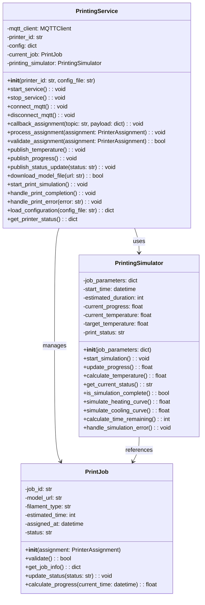

# ST Printer Service

## Architecture Position

The ST Printer service operates as an MQTT-based microservice that simulates individual 3D printer behavior within the automated printing lab. Each printer instance:

- Receives print job assignments from the Job Handler
- Reports temperature readings for monitoring (global temperature) and safety (anomaly detection)
- Publishes print progress updates for coordination with the Job Handler and Printer Monitoring Service

```text
┌─────────────────┐    MQTT Topics      ┌─────────────────┐
│   Job Handler   │ ──────────────────► │                 │
│                 │ device/printer/     │                 │
│                 │ {id}/assignment     │                 │
│                 │                     │                 │
################### publish separation ###########################
│                 │                     │                 │
│                 │      MQTT Topics    │                 │
│                 │ ◄────────────────── │                 │
│                 │ device/printer/     │                 │
└─────────────────┘ {id}/progress       │                 |
                                        │                 │
                                        │   ST Printer    │
┌─────────────────┐    MQTT Topics      │                 │
│   Printer       │   device/printer/   │                 │
│   Monitoring    │    {id}/progress    │                 │
│   Service       │ ◄────────────────── │                 │
│                 │                     │                 │
└─────────────────┘                     │                 │
                                        │                 │
┌──────────────────┐    MQTT Topics     │                 │
│Global Temperature│ ◄───────────────── │                 │
│                  │ device/printer/    │                 │
└──────────────────┘ {id}/temperature   └─────────────────┘
                                                │
                                                │ MQTT Topics
                                                │ device/printer/{id}/temperature
                                                │
                                                ▼
                                        ┌──────────────────┐
                                        │                  │
                                        │Printer Monitoring│
                                        └──────────────────┘

```

## Communication Protocols

### MQTT Subscriptions

#### Print Job Assignment

- **Topic**: `device/printer/{printerId}/assignment`
- **Type**: 2.2.3) PrinterAssignment
- **Purpose**: Receive print job assignments with model files and specifications

### MQTT Publications

#### Temperature Monitoring

- **Topic**: `device/printer/{printerId}/temperature`
- **Type**: 2.1.2) TemperatureReadingPrinter
- **Purpose**: Report current nozzle temperature for safety monitoring

#### Print Progress Updates

- **Topic**: `device/printer/{printerId}/progress`
- **Type**: 2.2.2) PrinterProgress
- **Purpose**: Report current print status and completion percentage

See [communication.md](../communication.md) for

## Printer Features

### Print Job Management

- **Assignment Processing**: Receives and validates print job assignments
- **Model File Handling**: Processes GCODE files from provided URLs (assumes local files)
- **Print Simulation**: Simulates realistic printing behavior with time progression
- **Status Tracking**: Maintains current job state and progress information

### Temperature Simulation

- **Realistic Temperature Curves**: Simulates heating up, printing, and cooling down phases given the nozzle in the PrinterAssignment. (assumes a cold bed temperature)
- **Thermal Behavior**: Simulates temperature fluctuations during printing
- **Safety Monitoring**: Often reports temperature anomalies for anomaly detection checks

### Printer Configuration and Operating Parameters

- printer ID
- printer type (e.g., Prusa MK3S, Creality Ender 3, Bambulab X1)
- filament type
- nozzle diameter
- max nozzle temperature, temp rate
- print speed (function based on filament type, nozzle diameter, layer height, infill)

## Journey

The ST Printer Service follows a complete print job lifecycle:

### 1. Initialization Phase

- Load printer configuration and operating parameters
- Initialize MQTT client and connect to broker
- Subscribe to assignment topic for the specific printer ID
- Initialize temperature sensor simulation
- Set printer status to "idle"

### 2. Assignment Reception Phase

- **Job Assignment**: Receive print job assignment from Job Handler
- **Validation**: Validate job parameters (model URL, filament type, estimated time)
  - **Callback Assignment**: The printer has a callback function that processes the change in assignment, updating its internal job state (checking if the assignment is not already in progress or completed)
- **Model Download**: Fetch GCODE file from provided URL
- **Preparation**: Initialize print simulation parameters
- **Status Update**: Report "printing" status with 0% progress

### 3. Printing Simulation Phase

- **Temperature Ramp-Up**: Simulate nozzle heating to target temperature
- **Print Progress**: Incrementally update print progress over estimated time
- **Temperature Monitoring**: Continuously report realistic temperature readings
- **Progress Reporting**: Publish progress updates at regular intervals

### 4. Completion Phase

- **Print Completion**: Report 100% progress and "completed" status
- **Cool-Down**: Simulate nozzle cooling down to room temperature
- **Plate Ready**: Signal that printed object is ready for collection
- **Status Reset**: Return to "idle" status awaiting robot collection

## Service Class Structure

### Separation of Concerns

The architecture follows a clear separation where:

- PrintingService handles external interactions:
  - MQTT subscriptions and publications
  - Print job assignment processing
  - Status and progress reporting
  - Temperature data publication

- PrintingSimulator handles the core printing logic:
  - Print progress calculation
  - Temperature simulation
  - Time management
  - State transitions

- PrintJob encapsulates job-specific data:
  - Job parameters and metadata
  - Validation logic
  - Status tracking

### Class Diagram



## Folder Structure

```text
st_printer/
├── app/                 
│   ├── printer_config.yaml
│   ├── printer_mqtt_config.yaml
│   |
│   ├── main.py         # Entry point
│   |
│   ├── dto/            # Data structures payload
│   ├── models/         # Models (Printer, PrintJob, etc.)
│   ├── mqtt/           # MQTT: Pub, Sub client; broker connection
│   └── services/       # Business logic (printing, simulation, job management)
|
├── Dockerfile          # Container build instructions
├── README.md           # Project documentation
├── requirements.txt    # Python dependencies
└── tests/              # Unit and integration tests
```

```text
│   ├── models/         # Data models:
│   │   ├── printer.py              # Defines Printer entity: configuration, status, capabilities
│   │   ├── print_job.py            # Defines PrintJob entity: job parameters, progress, metadata
│   │   ├── printer_assignment.py   # Represents assignment payloads from Job Handler
│   │   └── __init__.py             # Module initialization
│   │
│   ├── mqtt/           # MQTT communication layer:
│   │   ├── client.py               # MQTT client setup, connection, reconnection logic
│   │   ├── publisher.py            # Functions for publishing messages to topics
│   │   ├── subscriber.py           # Functions for subscribing and handling incoming messages
│   │   └── __init__.py             # Module initialization
│   │
│   └── services/       # Business logic modules:
│       ├── printing_service.py     # Orchestrates printer lifecycle, job assignment, MQTT integration
│       ├── printing_simulator.py   # Simulates print progress, temperature curves, and state transitions
│       ├── print_job_manager.py    # Manages job queue, validation, and progress tracking
│       └── __init__.py             # Module initialization
│
├── printer_config.yaml             # Printer configuration file (e.g., ID, parameters, capabilities)
├── printer_mqtt_config.yaml        # MQTT broker configuration file (e.g., host, port, topics)
├── main.py                         # Main entry point to start the service
|
```

## File and Folder Responsibilities

### models/

- **printer.py**  
  Defines the Printer entity: holds configuration (ID, type, capabilities), status (idle, printing, error), and capabilities (max temp, supported filaments).  
  *Used by services to get/set printer state and properties.*

- **print_job.py**  
  Implements the PrintJob entity: stores job parameters (model URL, filament type, estimated time), progress, and metadata.  
  *Used to track and update the current print job.*

- **printer_assignment.py**  
  Represents assignment payloads from the Job Handler (received via MQTT).  
  *Used to parse and validate incoming job assignments.*

- **__init__.py**  
  Initializes the models module.

---

### mqtt/

- **client.py**  
  Sets up the MQTT client, manages connection/reconnection to the broker.  
  *Used by services to connect and maintain MQTT communication.*

- **publisher.py**  
  Functions for publishing messages (temperature, progress, status) to MQTT topics.  
  *Called by services to send updates.*

- **subscriber.py**  
  Functions for subscribing to MQTT topics and handling incoming messages (e.g., job assignments).  
  *Used to listen for new assignments and commands.*

- **__init__.py**  
  Initializes the mqtt module.

---

### services/

- **printing_service.py**  
  Orchestrates the printer lifecycle: loads configs, manages job assignments, integrates MQTT, and coordinates simulation and reporting.  
  *Main logic entry point; interacts with all other modules.*

- **printing_simulator.py**  
  Simulates print progress, temperature curves, and state transitions.  
  *Called by printing_service to generate realistic printer behavior.*

- **print_job_manager.py**  
  Manages the job queue, validates assignments, and tracks job progress.  
  *Used by printing_service to handle multiple jobs and their states.*

- **__init__.py**  
  Initializes the services module.

---

### Config and Entry Files

- **printer_config.yaml**  
  Printer configuration (ID, parameters, capabilities).  
  *Loaded at startup by printing_service.*

- **printer_mqtt_config.yaml**  
  MQTT broker configuration (host, port, topics).  
  *Loaded at startup by mqtt.client.*

- **main.py**  
  Main entry point to start the service.  
  *Instantiates printing_service, loads configs, and starts the printer simulation.*

---

### Interactions

- `main.py` starts everything by loading configs and launching `printing_service.py`.
- `printing_service.py` uses `models/` for printer and job data, `mqtt/` for communication, and `services/printing_simulator.py` for simulation.
- MQTT modules handle all messaging between the printer and external services.
- Config files provide startup parameters for the printer