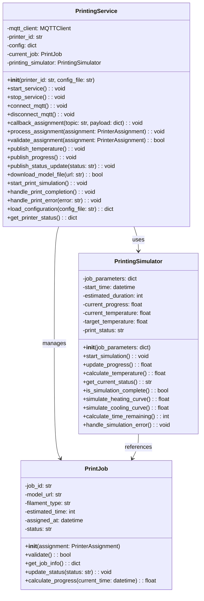

# ST Printer Service

## Architecture Position

The ST Printer service operates as an MQTT-based microservice that simulates individual 3D printer behavior within the automated printing lab. Each printer instance:

- Receives print job assignments from the Job Handler
- Reports temperature readings for monitoring (global temperature) and safety (anomaly detection)
- Publishes print progress updates for coordination with the Job Handler and Printer Monitoring Service

```text
┌─────────────────┐    MQTT Topics      ┌─────────────────┐
│   Job Handler   │ ──────────────────► │                 │
│                 │ device/printer/     │                 │
│                 │ {id}/assignment     │                 │
│                 │                     │                 │
################### publish separation ###########################
│                 │                     │                 │
│                 │      MQTT Topics    │                 │
│                 │ ◄────────────────── │                 │
│                 │ device/printer/     │                 │
└─────────────────┘ {id}/progress       │                 |
                                        │                 │
                                        │   ST Printer    │
┌─────────────────┐    MQTT Topics      │                 │
│   Printer       │   device/printer/   │                 │
│   Monitoring    │    {id}/progress    │                 │
│   Service       │ ◄────────────────── │                 │
│                 │                     │                 │
└─────────────────┘                     │                 │
                                        │                 │
┌──────────────────┐    MQTT Topics     │                 │
│Global Temperature│ ◄───────────────── │                 │
│                  │ device/printer/    │                 │
└──────────────────┘ {id}/temperature   └─────────────────┘
                                                │
                                                │ MQTT Topics
                                                │ device/printer/{id}/temperature
                                                │
                                                ▼
                                        ┌──────────────────┐
                                        │                  │
                                        │Printer Monitoring│
                                        └──────────────────┘

```

## Communication Protocols

### MQTT Subscriptions

#### Print Job Assignment

- **Topic**: `device/printer/{printerId}/assignment`
- **Type**: 2.2.3) PrinterAssignment
- **Purpose**: Receive print job assignments with model files and specifications

### MQTT Publications

#### Temperature Monitoring

- **Topic**: `device/printer/{printerId}/temperature`
- **Type**: 2.1.2) TemperatureReading
- **Purpose**: Report current nozzle temperature for safety monitoring

#### Print Progress Updates

- **Topic**: `device/printer/{printerId}/progress`
- **Type**: 2.2.2) PrinterProgress
- **Purpose**: Report current print status and completion percentage

See [communication.md](../communication.md) for

## Printer Features

### Print Job Management

- **Assignment Processing**: Receives and validates print job assignments
- **Model File Handling**: Processes GCODE files from provided URLs (assumes local files)
- **Print Simulation**: Simulates realistic printing behavior with time progression
- **Status Tracking**: Maintains current job state and progress information

### Temperature Simulation

- **Realistic Temperature Curves**: Simulates heating up, printing, and cooling down phases given the nozzle and bed temperatures in the PrinterAssignment
- **Thermal Behavior**: Simulates temperature fluctuations during printing
- **Safety Monitoring**: Often reports temperature anomalies for anomaly detection checks

### Printer Configuration and Operating Parameters

- printer ID
- printer type (e.g., Prusa MK3S, Creality Ender 3, Bambulab X1)
- filament type
- nozzle diameter
- max nozzle temperature, temp rate
- max bed temperature, temp rate
- print speed (function based on filament type, nozzle diameter, layer height, infill)

## Journey

The ST Printer Service follows a complete print job lifecycle:

### 1. Initialization Phase

- Load printer configuration and operating parameters
- Initialize MQTT client and connect to broker
- Subscribe to assignment topic for the specific printer ID
- Initialize temperature sensor simulation
- Set printer status to "idle"

### 2. Assignment Reception Phase

- **Job Assignment**: Receive print job assignment from Job Handler
- **Validation**: Validate job parameters (model URL, filament type, estimated time)
- **Model Download**: Fetch GCODE file from provided URL
- **Preparation**: Initialize print simulation parameters
- **Status Update**: Report "printing" status with 0% progress

### 3. Printing Simulation Phase

- **Temperature Ramp-Up**: Simulate nozzle heating to target temperature
- **Print Progress**: Incrementally update print progress over estimated time
- **Temperature Monitoring**: Continuously report realistic temperature readings
- **Progress Reporting**: Publish progress updates at regular intervals

### 4. Completion Phase

- **Print Completion**: Report 100% progress and "completed" status
- **Cool-Down**: Simulate nozzle cooling down to room temperature
- **Plate Ready**: Signal that printed object is ready for collection
- **Status Reset**: Return to "idle" status awaiting robot collection

## Separation of Concerns

The architecture follows a clear separation where:

- STBinaryPrintingService handles external interactions:
  - MQTT subscriptions and publications
  - Print job assignment processing
  - Status and progress reporting
  - Temperature data publication

- PrintingSimulator handles the core printing logic:
  - Print progress calculation
  - Temperature simulation
  - Time management
  - State transitions

- PrintJob encapsulates job-specific data:
  - Job parameters and metadata
  - Validation logic
  - Status tracking

## Service Class Structure


