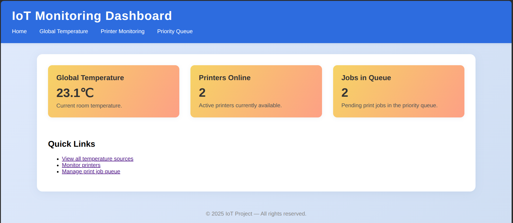
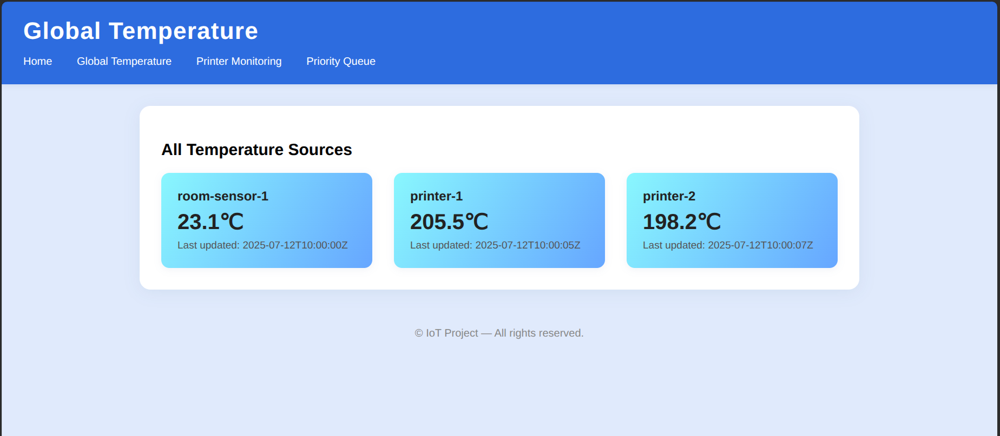
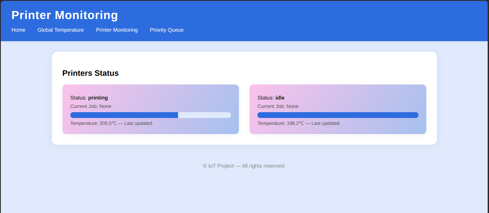
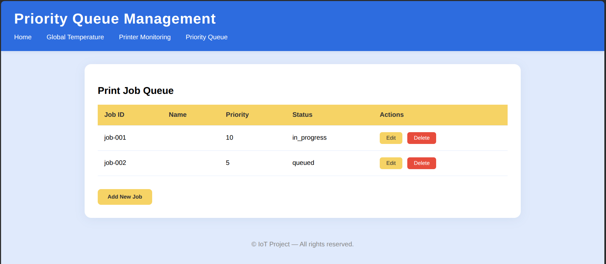
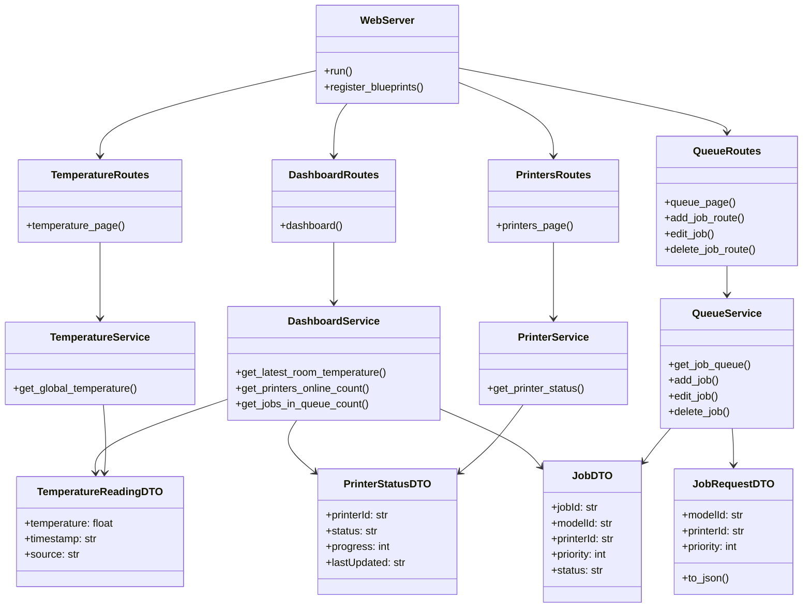

# Web UI Architecture Overview

## Table of Contents

1. [Current Architecture Position](#current-architecture-position)
2. [Web Server is Outside API Gateway](#web-server-is-outside-api-gateway)
    - [Gateway Traffic Flow](#gateway-traffic-flow)
3. [Communication Protocols](#communication-protocols)
    - [Global Temperature Endpoint](#global-temperature-endpoint)
    - [Printer Monitoring Endpoint](#printer-monitoring-endpoint)
    - [Priority Queue Management Endpoint](#priority-queue-management-endpoint)
4. [Web Pages Overview](#web-pages-overview)
5. [Web Server Class Diagram](#web-server-class-diagram)
    - [Class Diagram Overview](#class-diagram-overview)
6. [Folder Structure](#folder-structure)
7. [Local](#local)
    - [Local Run Instructions](#local-run-instructions)
    - [Local Testing Instructions](#local-testing-instructions)
8. [Docker](#docker)
    - [Docker Run Instructions](#docker-run-instructions)
    - [Docker testing instructions](#docker-testing-instructions)
9. [Docker Compose](#docker-compose)
    - [Note on Docker Compose testing](#note-on-docker-compose-testing)

## Current Architecture Position

The Web UI service operates **outside** the API Gateway as a frontend client that consumes backend APIs. Here's the architectural positioning:

```text
┌─────────────────┐    HTTP Requests  ┌─────────────────┐
│   Web Browser   │ ────────────────► │   Web Server    │ ◄── Outside API Gateway
│   (Users)       │ ◄──────────────── │                 │     (Client of backend APIs)
└─────────────────┘    HTML Pages     └─────────────────┘
                                              │
                                              │ External API Calls
                                              │ (acts as HTTP client)
                                              ▼
                                      ┌─────────────────┐
                                      │   API Gateway   │ ◄── Entry point for APIs
                                      │                 │     (Routes to backend)
                                      └─────────────────┘
                                              │
                                              │ Routes to
                                              ▼
┌─────────────────────────────┬─────────────────────────────┬─────────────────────────────┐
│  Telemetry Service          │  Printer Service            │  Job Queue Service          │
│  - GET /temperature/global  │  - GET /printers/status     │  - GET /jobs                │
│    (Returns temperature     │    (Returns printer status) │    (Returns job queue)      │
│     readings)               │                             │  - POST /jobs               │
│                             │                             │    (Add new job)            │
│                             │                             │  - PUT /jobs/{jobId}        │
│                             │                             │    (Edit job priority)      │
│                             │                             │  - DELETE /jobs/{jobId}     │
│                             │                             │    (Delete job)             │
└─────────────────────────────┴─────────────────────────────┴─────────────────────────────┘
```

## Web Server is Outside API Gateway

- **Web Server**: Serves HTML pages to browsers, Consumes data from gateway APIs and renders it as HTML, Handles user interface layer (browser-to-server)
- **API Gateway**: Manages JSON API communication between services

### Gateway Traffic Flow

1. **Browser** → **Web Server** (HTML requests)
    - User navigate to a URL in the browser, which sends an HTTP request (GET /telemetry/device123) to the Web Server.

2. **Web Server** → **API Gateway** → **Backend Services** (Data requests)
    - Flask server receives the request, extracts the device ID, and makes an external API call to the API Gateway to fetch telemetry data for that device.

3. **Backend Services** → **API Gateway** → **Web Server** (Data responses)
    - The API Gateway routes the request to the appropriate backend service (e.g., Telemetry Service), which processes the request and returns the telemetry data.
    - Flask server receives the data and prepares it for rendering.

4. **Web Server** → **Browser** (HTML responses)
    - Flask server renders the HTML template with the telemetry data and sends it back to the browser as an HTTP response.

## Communication Protocols

### HTTP API - Requests - (through API Gateway)

#### Global Temperature Endpoint

- **Endpoint**: `<api_gateway>/temperature/global`
- **Method**: GET
- **Response**: List of all temperature readings (room and printers)
- **Type**: TemperatureReading[]

#### Printer Monitoring Endpoint

- **Endpoint**: `<api_gateway>/printers/status`
- **Method**: GET
- **Response**: List of all printer statuses (job status, progress, last updated)
- **Type**: PrinterStatus[]

#### Priority Queue Management Endpoint

##### **GET**

- **Endpoint**: `<api_gateway>/jobs`
- **Method**: GET
- **Response**: List of all print jobs in the queue
- **Type**: Job[]

##### **POST**

- **Endpoint**: `<api_gateway>/jobs`
- **Method**: POST
- **Body**: New job data
- **Response**: Created job details

##### **PUT**

- **Endpoint**: `<api_gateway>/jobs/{jobId}`
- **Method**: PUT
- **Body**: Updated job priority
- **Response**: Updated job details

##### **DELETE**

- **Endpoint**: `<api_gateway>/jobs/{jobId}`
- **Method**: DELETE
- **Response**: Success message (204 No Content)

See [communication.md](../communication.md) for full message schemas.

## Web Pages Overview

The Web UI consists of four main pages, each designed for a specific operational purpose:

1. **Dashboard/Home Page (/)**
   - **Purpose:** Provide a summary of the system’s key metrics for quick status assessment.
   - **How is done:** Displays overview cards for global temperature, printers online, and jobs in queue. Navigation links allow users to access detailed pages.
   - *Image below shows summary cards and navigation links.*
   

2. **Global Temperature Page (/temperature)**
   - **Purpose:** Show real-time temperature readings from all monitored sources.
   - **How is done:** Renders a grid of cards, each representing a device (room or printer) with its current temperature and status.
   - *Image below illustrates the grid of temperature cards for each source.*
   

3. **Printer Monitoring Page (/printers)**
   - **Purpose:** Monitor the operational status and progress of all printers.
   - **How is done:** Displays each printer as a card, showing temperature, status (idle/printing/error), current job, progress, and last updated timestamp.
   - *Image below demonstrates the printer status cards and their key indicators.*
   

4. **Priority Queue Management Page (/queue)**
   - **Purpose:** Manage and prioritize print jobs in the queue.
   - **How is done:** Shows a table of print jobs, a side panel for job details, and action buttons to add, edit priority, or delete jobs.
   - *Image below shows the job queue table, details panel, and action buttons.*
   

## Web Server Class Diagram

### Class Diagram Overview

This class diagram shows the internal structure of the Web UI backend.  

- **WebServer** is the entry point, registering route modules for each page.
- **Routes** handle HTTP requests and delegate logic to their respective **Service** classes.
- **Services** interact with backend APIs and process data.
- **DTOs** (Data Transfer Objects) define the structure of data exchanged between layers.
This separation of concerns improves maintainability, scalability, and clarity in the codebase.



## Folder Structure

```text
web-ui/
├── app
│   ├── dto  
│   │   ├── job_request_dto.py
│   │   ├── job_response_dto.py
│   │   ├── printer_status_request_dto.py
│   │   ├── printer_status_response_dto.py
│   │   ├── temperature_reading_request_dto.py
│   │   └── temperature_reading_response_dto.py
│   │
│   ├── routes
│   │   ├── dashboard.py
│   │   ├── printers.py
│   │   ├── queue.py
│   │   └── temperature.py
│   │
│   ├── services
│   │   ├── dashboard_service.py
│   │   ├── printer_service.py
│   │   ├── queue_service.py
│   │   └── temperature_service.py
│   │
│   ├── templates
│   │   ├── add_job.html
│   │   ├── dashboard.html
│   │   ├── edit_job.html
│   │   ├── printers.html
│   │   ├── queue.html
│   │   └── temperature.html
│   │
│   ├── web_conf.yaml
│   │
│   ├── web_server.py
│   ├── web_server_proces_docker.py
│   └── web_server_proces_local.py
│
├── target_web_conf.yaml
├── tests
│   └── fake_api_response.py
│
├── Dockerfile
├── images
├── README.md
└── requirements.txt
```

- **app/dto/**  
  Contains Data Transfer Objects (DTOs) for structuring and validating data exchanged between the web server and backend APIs.

- **app/routes/**  
  Defines Flask route handlers for each web page (dashboard, printers, queue, temperature). Each file maps URLs to Python functions that render HTML templates.

- **app/services/**  
  Implements API communication. Services fetch and process data from backend APIs, using DTOs for validation and serialization.

- **app/templates/**  
  Stores HTML templates rendered by Flask for each page. (use Jinja2 templating engine for variable rendering).

- **app/web_server.py**  
  Flask web server class. Registers blueprints (routes) and has methods to start and stop the application.
- **app/web_server_proces_docker.py**  
  Entry point for running the web server in Docker. It sets up the Flask application and starts the server handling running loop for Docker application.
- **app/web_server_proces_local.py**  
  Entry point for running the web server locally. It sets up the Flask application and starts the server handling running loop for local development using input().

- **app/web_conf.yaml**  
  Configuration file for **local** IP and port for webpage and API gateway.

- **target_web_conf.yaml**  
  Configuration file for **Docker** IP and port for webpage and API gateway.

- **tests/**  
  Contains test scripts and a mock API server (`fake_api_response.py`) for local testing and simulating backend responses. It runs on port 8080 by default, which is used by the API Gateway in production. Print the API requests to the console for debugging.

- **Dockerfile**  
  Instructions for building a Docker image of the web server for containerized deployment.

## Local

### Local Run Instructions

1. **Install Dependencies**  
   Run the following command to install required packages:

   ```bash
   pip install -r requirements.txt
   ```

2. **Start the Server**  
   Navigate to the project directory and start the Flask web server:

   ```bash
   cd IoT_Project/web-ui
   python3 -m app.web_server_proces_local
   ```

3. **Access the Dashboard**  
   Open your web browser and go to [http://localhost:5000](http://localhost:5000) to view the IoT dashboard.

### Local Testing Instructions

To test the application with mock data, use the provided mock API server:

1. Open a separate terminal and navigate to the tests folder:

   ```bash
   cd IoT_Project/web-ui/tests
   python3 fake_api_response.py
   ```

2. The mock server simulates API responses for testing purposes.  
   It runs on port 8080 by default, matching the port used by the API Gateway in production.
   It prints API requests to the console for debugging.

## Docker

### Docker Run Instructions

To run the Web UI server in Docker, follow these steps:

0. **Possible Prerequisites**  
   Ensure you have Docker network bridge launched for communication with the API Gateway.

1. **Build the Docker image**  

   From the `web-ui` directory, run:

   ```bash
   docker build -t web-ui-image .
   ```

2. **Run the container with custom configuration**  

   Use the provided `target_web_conf.yaml` for Docker settings.  
   Mount it into the container and expose the correct port:

   ```bash
   docker run --name web-ui-container \
     -p 8000:8000 \
     -v ${PWD}/target_web_conf.yaml:/app/web_conf.yaml \
     --restart always \
     -d \
     web-ui-image
   ```

   - The `-p 8000:8000` maps the container's port 8000 to your host's port 8000, see flowchart/port_flowchart.mmd for details.
   - The web server will be available at [http://localhost:8000](http://localhost:8000).
   - `${PWD}` ensures the config file is mounted from your current directory.

3. **Stop and remove the container**  

   ```bash
   docker stop web-ui-container
   docker rm web-ui-container
   ```

4. **Remove the Docker image**  

   If you want to remove the image after stopping the container:

   ```bash
   docker rmi web-ui-image
   ```

5. **View logs**  

   To view the logs of the running container, use:

   ```bash
   docker logs web-ui-container
   ```

   This will show you the output from the Flask server, including any errors or debug information.

6. **Enter into the container**  

   If you need to access the container's shell for debugging or inspection, you can use:

   ```bash
   docker exec -it web-ui-container /bin/bash
   ```

   This will give you a terminal inside the running container.

### Docker testing instructions

To test the application in Docker with mock data, you can run the mock API server in a separate container:

0. **Launch Docker network bridge**  
   Ensure you have a Docker network bridge set up for communication with the API Gateway. This is typically done in the main readme of the project.

   The istructions below assume you have a network named `iot_network` created. If not, create it with:

   ```bash
   docker network create iot_network
   ```

1. **Build the Docker image for the mock API server**  

   From the `tests` directory, run:

   ```bash
   docker build -t mock-api-server-images .
   ```

2. **Run the mock API server container**  

   ```bash
   docker run --name api-gateway \
     -p 8080:8080 \
     --network iot_network \
     mock-api-server-images
   ```

   This will start the mock API server, which listens on port 8080.

3. **Run the Web UI container with network settings**  

   Ensure the Web UI container is also connected to the same network (`iot_network`) so it can communicate with the mock API server:

   ```bash
   docker run --name web-ui-container \
     -p 8000:8000 \
     -v ${PWD}/target_web_conf.yaml:/app/web_conf.yaml \
     --network iot_network \
     --restart always \
     web-ui-image
   ```

## Docker Compose

For Web UI with Docker Compose, follow the main readme instructions in the root directory of the project. ([main readme](../README.md))

### Note on Docker Compose testing

For testing the fake api gateway with Docker Compose of the project, you launch the docker-compose file and then launch the mock API server in a separate terminal,
but you need to change the network name to `composed-mqtt-project_iot_network` (<docker-compose_name>_<network_name>) according to the docker-compose file.
