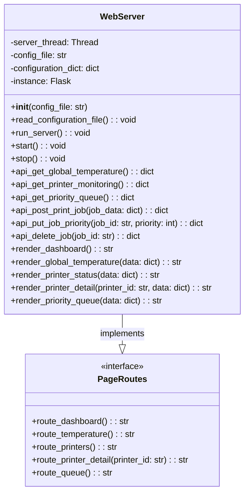

# Web UI Architecture Overview

## Current Architecture Position

The Web UI service operates **outside** the API Gateway as a frontend client that consumes backend APIs. Here's the architectural positioning:

```text
┌─────────────────┐    HTTP Requests  ┌─────────────────┐
│   Web Browser   │ ────────────────► │   Web Server    │ ◄── Outside API Gateway
│   (Users)       │ ◄──────────────── │   (Port 7071)   │     (Client of backend APIs)
└─────────────────┘    HTML Pages     └─────────────────┘
                                              │
                                              │ External API Calls
                                              │ (acts as HTTP client)
                                              ▼
                                      ┌─────────────────┐
                                      │   API Gateway   │ ◄── Entry point for APIs
                                      │   (Port 8080)   │     (Routes to backend)
                                      └─────────────────┘
                                              │
                                              │ Routes to
                                              ▼
                                   ┌─────────────────────────┐
                                   │    Backend Services     │
                                   │  (Inventory, Telemetry) │
                                   └─────────────────────────┘
```

## Web Server is Outside API Gateway

- **Web Server**: Serves HTML pages to browsers, Consumes data from gateway APIs and renders it as HTML, Handles user interface layer (browser-to-server)
- **API Gateway**: Manages JSON API communication between services

## Traffic Flow

1. **Browser** → **Web Server** (HTML requests)
    - User navigate to a URL in the browser, which sends an HTTP request (GET /telemetry/device123) to the Web Server.

2. **Web Server** → **API Gateway** → **Backend Services** (Data requests)
    - Flask server receives the request, extracts the device ID, and makes an external API call to the API Gateway to fetch telemetry data for that device.

3. **Backend Services** → **API Gateway** → **Web Server** (Data responses)
    - The API Gateway routes the request to the appropriate backend service (e.g., Telemetry Service), which processes the request and returns the telemetry data.
    - Flask server receives the data and prepares it for rendering.

4. **Web Server** → **Browser** (HTML responses)
    - Flask server renders the HTML template with the telemetry data and sends it back to the browser as an HTTP response.

## Web page content

### Global Temperature

Displays all temperature readings from all sources

### Printer Monitoring

Show current status of all printers, including: temperature, status (idle/printing/error), current job, progress, last updated timestamp.

### Priority Queue Management

Get current print job queue with information
Post new print jobs
Modify job priorities (reorder queue)(put)
Delete jobs from queue

## Page Organization

1. Dashboard/Home Page (/)
Overview Cards: Summary widgets showing key metrics from all three areas.
Link for navigation.

2. Global Temperature Page (/temperature)
Device Grid: Cards for each temperature source with current readings

3. Printer Monitoring Page (/printers)
Printer Grid: Card layout showing each printer's status
3.1 Detailed View (/printers/:id): Click-to-expand for individual printer details

4. Priority Queue Management Page (/queue)
Queue Table: List of print jobs
Job Details Panel: Side panel showing selected job information
Action Buttons: Add, edit priority, delete

## Web Server Class Diagram


