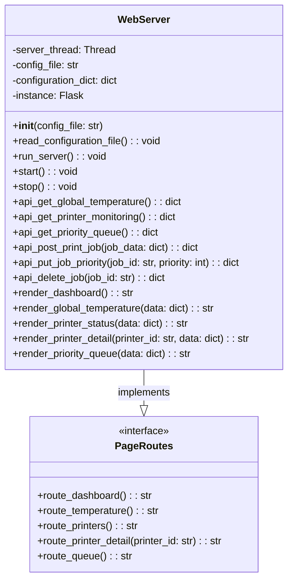

# Web UI Architecture Overview

- [ ] dto ??
- [ ] docker
- [ ] porte -> main port??
- [ ] table of contents da sistemare
- [ ] header piu basso

## Table of Contents

- [Current Architecture Position](#current-architecture-position)
- [Web Server is Outside API Gateway](#web-server-is-outside-api-gateway)
- [Traffic Flow](#traffic-flow)
- [Communication Protocols](#communication-protocols)
- [Web page content](#web-page-content)
  - [Global Temperature](#global-temperature)
  - [Printer Monitoring](#printer-monitoring)
  - [Priority Queue Management](#priority-queue-management)
- [Page Organization](#page-organization)
- [Web Server Class Diagram](#web-server-class-diagram)
- [Folder Structure](#folder-structure)

## Current Architecture Position

The Web UI service operates **outside** the API Gateway as a frontend client that consumes backend APIs. Here's the architectural positioning:

```text
┌─────────────────┐    HTTP Requests  ┌─────────────────┐
│   Web Browser   │ ────────────────► │   Web Server    │ ◄── Outside API Gateway
│   (Users)       │ ◄──────────────── │                 │     (Client of backend APIs)
└─────────────────┘    HTML Pages     └─────────────────┘
                                              │
                                              │ External API Calls
                                              │ (acts as HTTP client)
                                              ▼
                                      ┌─────────────────┐
                                      │   API Gateway   │ ◄── Entry point for APIs
                                      │                 │     (Routes to backend)
                                      └─────────────────┘
                                              │
                                              │ Routes to
                                              ▼
                                   ┌─────────────────────────┐
                                   │    Backend Services     │
                                   │  (Inventory, Telemetry) │
                                   └─────────────────────────┘
```

## Web Server is Outside API Gateway

- **Web Server**: Serves HTML pages to browsers, Consumes data from gateway APIs and renders it as HTML, Handles user interface layer (browser-to-server)
- **API Gateway**: Manages JSON API communication between services

## Traffic Flow

1. **Browser** → **Web Server** (HTML requests)
    - User navigate to a URL in the browser, which sends an HTTP request (GET /telemetry/device123) to the Web Server.

2. **Web Server** → **API Gateway** → **Backend Services** (Data requests)
    - Flask server receives the request, extracts the device ID, and makes an external API call to the API Gateway to fetch telemetry data for that device.

3. **Backend Services** → **API Gateway** → **Web Server** (Data responses)
    - The API Gateway routes the request to the appropriate backend service (e.g., Telemetry Service), which processes the request and returns the telemetry data.
    - Flask server receives the data and prepares it for rendering.

4. **Web Server** → **Browser** (HTML responses)
    - Flask server renders the HTML template with the telemetry data and sends it back to the browser as an HTTP response.

## Communication Protocols

### HTTP API - Requests - (through API Gateway)

#### Global Temperature Endpoint

- **Endpoint**: `/temperature/global`
- **Method**: GET
- **Response**: List of all temperature readings (room and printers)
- **Type**: TemperatureReading[]

#### Printer Monitoring Endpoint

- **Endpoint**: `/printers/status`
- **Method**: GET
- **Response**: List of all printer statuses (job status, progress, last updated)
- **Type**: PrinterStatus[]

#### Priority Queue Management Endpoint

- **Endpoint**: `/jobs`
- **Method**: GET
- **Response**: List of all print jobs in the queue
- **Type**: Job[]

- **Endpoint**: `/jobs`
- **Method**: POST
- **Body**: New job data
- **Response**: Created job details

- **Endpoint**: `/jobs/{jobId}`
- **Method**: PUT
- **Body**: Updated job priority
- **Response**: Updated job details

- **Endpoint**: `/jobs/{jobId}`
- **Method**: DELETE
- **Response**: Success message (204 No Content)

See [communication.md](../communication.md) for full message schemas.

## Web page content

### Global Temperature

Displays all temperature readings from all sources

### Printer Monitoring

Show current status of all printers, including: temperature, status (idle/printing/error), current job, progress, last updated timestamp.

### Priority Queue Management

Get current print job queue with information
Post new print jobs
Modify job priorities (reorder queue)(put)
Delete jobs from queue

## Page Organization

1. Dashboard/Home Page (/)
Overview Cards: Summary widgets showing key metrics from all three areas.
Link for navigation.

2. Global Temperature Page (/temperature)
Device Grid: Cards for each temperature source with current readings

3. Printer Monitoring Page (/printers)
Printer Grid: Card layout showing each printer's status
3.1 Detailed View (/printers/:id): Click-to-expand for individual printer details

4. Priority Queue Management Page (/queue)
Queue Table: List of print jobs
Job Details Panel: Side panel showing selected job information
Action Buttons: Add, edit priority, delete

## Web Server Class Diagram



## Folder Structure

Below is the folder structure:

```plaintext
web-ui/
├── app/
│   ├── templates/           # HTML templates for rendering web pages
│   ├── routes/              # Route handlers for each page (Flask Blueprints)
│   ├── services/            # Logic for communicating with the API Gateway
│   ├── model/               # Internal data models (if needed)
│   ├── dto/                 # Schemas for request/response validation
│   ├── web_server.py        # Main Flask server entry point
│
├── tests/                   # Unit tests 
│
├── target_web_conf.yaml     # Web server config
│
├── Dockerfile               # Containerization instructions
├── requirements.txt         # Python dependencies
└── README.md                # Documentation and architecture overview
```

### Brief Explanation

- **app/templates/**: Contains HTML files for all web pages (dashboard, temperature, printers, queue).
- **app/routes/**: Organizes route handlers for each page using Flask Blueprints for modularity.
- **app/services/**: Implements logic for making HTTP requests to the API Gateway and processing responses.
- **app/model/**: Defines internal data structures if needed for business logic.
- **app/dto/**: Provides schemas for validating and serializing/deserializing data exchanged with backend APIs.
- **app/web_server.py**: Main entry point for the Flask server, sets up routes and server configuration.

- **tests/**: Contains test cases for route handlers, API client logic, and rendering.
- **target_web_conf.yaml**: Configuration file for the web server, specifying settings like API Gateway URL and port.
- **Dockerfile**: Instructions to build the web-ui container for deployment.
- **requirements.txt**: Lists Python dependencies required by the web-ui service.
- **README.md**: Documents architecture, traffic flow, and usage instructions.

## Run Instructions

1. **Set Up Environment**: Ensure you have Python 3.8+ and pip installed.
2. **Install Dependencies**: Run `pip install -r requirements.txt` to install required packages.
3. **Start the Server**:

Run the Flask web server using the following command:

move to IoT_Project/web-ui

```bash
    python3 -m app.web_server
```

4.**Access the Dashboard**: Open a web browser and navigate to `http://localhost:5000` to view the IoT dashboard.

## Testing

To test the application, you can use the provided mock API server. Run the following command in a separate terminal:

move to IoT_Project/web-ui/tests

```bash
    python3 fake_api_response.py 
```

In this mock server, you can simulate API responses for testing purposes. The mock server runs on port 8080 by default that is used by the API Gateway in production.
